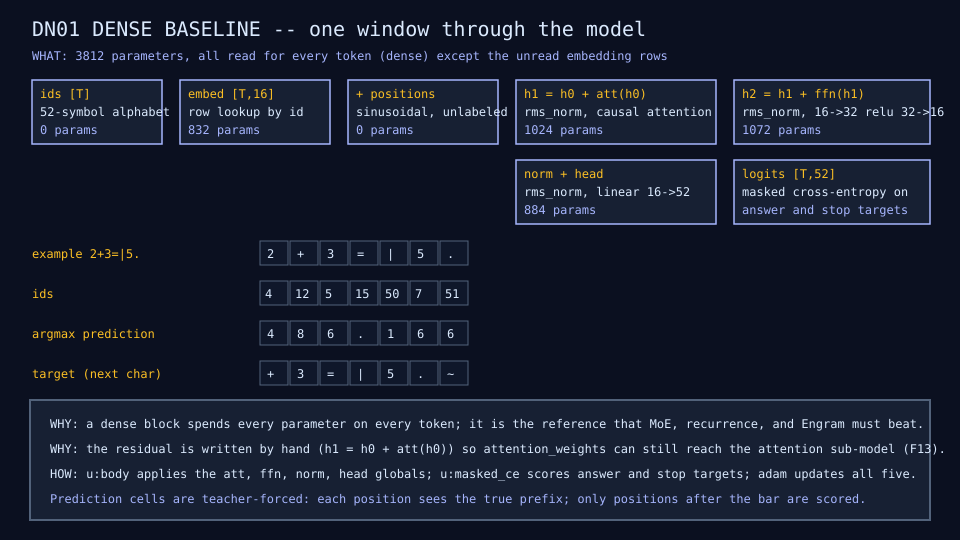
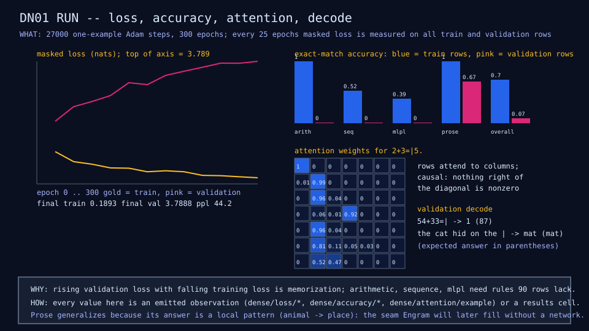

# moe-microscope

Building mixture-of-experts models small enough to understand.

`moe-microscope` is an sw-MLPL project that builds a tiny mixture-of-experts
language model, MicroMoE, from scratch and lets a learner look inside every
part of it. The model combines four ideas that normally live at very different
scales: FreeToken-style heterogeneous expert execution (an expert cache that
follows real routing decisions), HRM/TRM-style recursion (one shared block
applied several times instead of many unique layers), DeepSeek-style Engram
conditional memory (hashed n-gram lookup instead of neural memorization), and
ordinary sparse routing over many tiny experts.

Each mechanism is a separate, executable lesson. Every lesson records its own
intermediate values, ships annotated diagrams of each data structure and
transformation, and measures memory, speed, and quality. The learner reads the
MLPL, changes it, reruns it, and watches the numbers and pictures change.

## Summary

The repository progresses through comparable stages rather than starting from
the final architecture:

| Stage | Lesson | What it adds | Question it answers |
|---|---|---|---|
| 0 | DN01 | dense tiny transformer | the baseline |
| 1 | RC01 | one shared block applied `R` times | does repeated compute replace parameters? |
| 2 | EG01 | Engram n-gram memory, built from scratch | does external memory help? |
| 3-4 | MX01, MX02 | top-1 and top-2 routing over a bank of experts | can experts specialize, and is top-2 worth it? |
| 5-6 | RM01, RE01 | recurrent MoE, then with Engram | does routing change over reasoning time? |
| 7 | KD01 | distillation from an in-repo teacher | which distillation term buys what? |
| 8 | QZ01 | INT8 then INT4 experts | what quality is lost, how many more experts fit? |
| 9 | XC01 | capacity-limited LRU expert cache | what does cache size do to hits, bytes, speed? |
| 10 | HY01 | CPU/NPU hybrid with the q-star split | can FreeToken-style scheduling help? |
| 11 | PK01 | packed TinyMoE file and a 256 MB budget | can the whole thing survive an embedded budget? |

The model works in a constrained mixture where value is measurable per task:
small-integer arithmetic, sequence transformations, tiny MLPL expressions
checked against the interpreter itself, and short templated prose. Experts are
distilled at four levels, token distributions from a teacher, a router warm
start from task tags, low-rank expert deltas fitted to a dense teacher, and
deep supervision across recurrences, each measured alone against the baseline.
The [delivery plan](docs/plan.md) explains both choices in detail.

The repository dogfoods sw-MLPL twice: as the language for building the model
and its runtime pieces, and, together with `../demo-extensions`, as the
toolchain for the educational visualization itself. Shipped features are
preferred over rebuilt ones; a mechanism is built from scratch only where
watching it is the lesson, and then both forms are shown with a parity check.
Every gap becomes a reproducer, a pinned probe, and an upstream work order in
[`docs/sw-mlpl-findings.md`](docs/sw-mlpl-findings.md); the first four were
fixed upstream the day they were filed.

The microscope scale (CPU, seconds, tens of thousands of parameters) is the
acceptance scale for every lesson. The same source runs at a lab scale under
`device("mlx") { }`. The 256 MB, 0.5 TOPS device is an inference target for
the packed file, not a training target.

## Synthetic domain microscope

DM01 is the first executable microscope. It shows the three data structures
every later lesson consumes: the padded token window with its shifted targets
and answer mask, the task tags that make expert specialization measurable,
and the seeded split that holds rows out. Each diagram is drawn from values a
test asserts and annotated with what the structure is, why the model needs
it, and how the MLPL computes it.


```sh
just domain          # run the demo and check the three diagrams are fresh
just domain write    # regenerate the committed diagrams from the demo
just tests           # 28 native tests over the generators, oracles, evaluation, and results writer
```

The four task families are small-integer arithmetic, `rev`/`sort` sequence
transformations, tiny MLPL expressions whose answers come from the named
builtin, and templated prose with a fixed animal-to-place pattern. The
mixture ratios, total, window, and split fraction live in
[`fixtures/domain/mixture-v0.json`](fixtures/domain/mixture-v0.json). The
exact-match harness reports accuracy per family and overall, and the results
writer appends one fixed-column row per lesson run to
[`docs/results.md`](docs/results.md).

## Dense baseline microscope

DN01 trains the reference model every later mechanism must beat: one
transformer block with 16-wide embeddings, one causal attention head, and a
32-wide feed-forward layer, 3,812 parameters in all, trained one example at a
time on the 90 training rows for 300 epochs. The run takes about 16 seconds
on a laptop and is deterministic, so its diagrams and results row are checked
for freshness by the gate.





```sh
just dense           # run DN01 and check its diagrams and results row
just dense write     # regenerate the committed diagrams and the DN01 results row
```

The result is the honest dense baseline: training loss falls to 0.19 while
validation loss rises to 3.79, training rows are reproduced 70 percent of the
time, and on held-out rows only the prose family (a local animal-to-place
pattern) is answered correctly, two times in three. Arithmetic, sequence, and
MLPL answers need rules this model cannot learn from 90 rows. The numbers are
one row in [`docs/results.md`](docs/results.md), and the residual is written
by hand so `attention_weights` can show the trained attention map.

## Recording and host handoff

Every lesson's observations are also captured over the live `mlpl-serve`
SSE path into a recording under the peer version-zero schema from
`../demo-ml-microscope`, pinned by hash in
[`fixtures/recordings/index-v1.json`](fixtures/recordings/index-v1.json). The
generic Rust/Yew/WASM microscope in `../demo-extensions` renders these
recordings without lesson-specific Rust; the work order is
[`docs/host-handoff.md`](docs/host-handoff.md). Because the server surface
has no `include`, `scripts/bundle-program` inlines a lesson's library tree
into the single program a host submits.

```sh
just emit-frame-loops     # every train step and while iteration streams in order
just recording-check      # schema, budgets, shapes, names, trend, pinned hashes
just dense-recording      # a live server run of DN01 equals the committed recording
just build-local-serve    # compile a current mlpl-serve into tmp/ without touching ../sw-mlpl
```

The scripts select an absolute `MLPL_SERVE` override, then a local build
under `tmp/` made by `scripts/build-local-serve` (which compiles the adjacent
source into this repository's ignored directory and never touches the
sibling), then `../sw-mlpl/target/release/mlpl-serve`. Rebuild locally when
the adjacent server binary is older than the evaluator fixes it needs.

## What is here

```text
docs/plan.md                 Delivery plan, sagas, the distillation and domain answers
docs/sagas.md                Saga queue (active and future)
docs/architecture.md         Ownership, layering, the model under the lens
docs/sw-mlpl-blockers.md     Capability ledger: supported, awkward, blocked
docs/sw-mlpl-findings.md     Upstream work orders with reproducers and status
docs/cross-repo-handoffs.md  Read-only work orders for sibling repositories
docs/host-handoff.md         The demo-extensions work order for the DN01 recording
docs/results.md              Memory/speed/quality rows, one per lesson run
catalog/lessons.toml         Lesson inventory with implementation form and measured triple
docs/research.txt            The original design discussion
lib/  demos/  tests/         MLPL model code, lessons, and native mlplunit tests
probes/                      Standalone reproducers re-checked by the gate
fixtures/  assets/previews/  Bounded fixtures, pinned recordings, and committed diagrams
catalog/                     Machine-readable lesson inventory
scripts/  justfile           Thin gate and tool-selection scripts
```

Lesson code lands saga by saga; see [`docs/sagas.md`](docs/sagas.md) for what
is active.

## Build and run

Prerequisites:

- the adjacent `../sw-mlpl` checkout built in release mode
  (`target/release/mlpl-repl`), or an absolute `MLPL` override;
- `mlplunit` on `PATH`, an absolute `MLPLUNIT` override, or the adjacent
  `../../softwarewrighter/mlplunit/bin/mlplunit` checkout;
- [`just`](https://github.com/casey/just);
- `agentrail` for the development process.

The scripts only select existing tools; they never install or overwrite them.

```sh
just                 # list recipes
just check           # the complete pre-commit gate
just tests           # native mlplunit tests (arguments filter paths or tags)
just probes          # re-run the upstream-finding reproducers
just domain          # run DM01 and check its diagrams
just dense           # run DN01 (about 16 s) and check its diagrams and results row
just mlpl-style      # canonical formatting and docstring checks
```

`just check` validates repository structure, documentation links,
peer-identical license files, the generated Agentrail briefing, MLPL style,
the native test suites, the pinned reproducers, and the DM01 and DN01 lessons
with their diagrams and results row (about half a minute in total). Each lesson extends the
gate with its own demo run, preview freshness check, recording check, and
catalog check.

The interactive host is the generic Rust/Yew/WASM microscope and MLPL web
framework in `../demo-extensions`; that Rust code is the only part of this
effort subject to `sw-checklist`.

## Development process

Work is divided into durable Agentrail steps. In each fresh session run
`agentrail next`, then `agentrail begin`; implement only that step; run focused
tests and `just check`; commit source and `.agentrail/` metadata by name; push
`main`; and only then run `agentrail complete`. [`AGENTS.md`](AGENTS.md) holds
the full repository protocol and `CLAUDE.md` links to it.

## Copyright and license

Copyright (c) 2026 Michael A Wright. See [COPYRIGHT](COPYRIGHT).

Distributed under the [MIT License](LICENSE).
