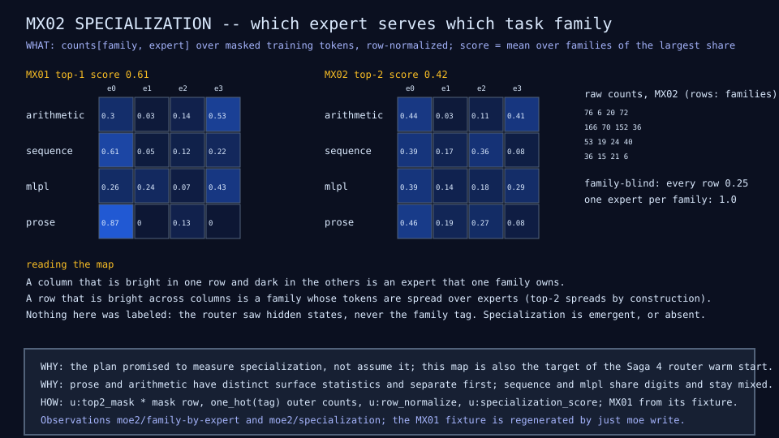
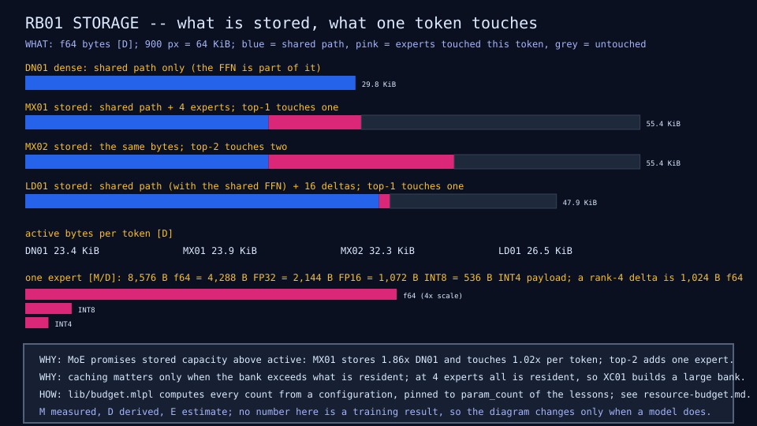

# moe-microscope

Building mixture-of-experts models small enough to understand.

MicroMoE is an educational and experimental mixture-of-experts model
written in sw-MLPL. The repository isolates the techniques behind modern
efficient MoE systems (routing, sparse dispatch, low-rank experts,
recurrence, Engram memory, distillation, quantization, expert caching,
heterogeneous execution) so each can be inspected and measured on its own,
at a scale where every tensor, expert, routing decision, and byte can be
printed. It is progressively constructing a tiny model inspired by
FreeToken, HRM/TRM, DeepSeek's Engram, and sparse routing; it does not
claim that the combined architecture is validated yet.

Large MoE systems make it hard to see what each mechanism buys. Here the
whole model is tens of thousands of parameters, every lesson is a readable
MLPL program that records its own intermediate values, every diagram is
drawn from values a test asserts, and every claim in this page cites a
results row or a measured document.

- [Documentation landing page](docs/README.md) (three reader journeys)
- [Architecture](docs/overview/architecture.md) and [delivery plan](docs/overview/plan.md)
- [Results dashboard](docs/results/README.md) and the [full results table](docs/reference/results.md)

## Live demo

The moving parts step by step, live on GitHub Pages:
<https://sw-ml-study.github.io/moe-microscope/>. Pick a lesson (the dense
baseline, the top-1 and top-2 mixtures, or one window through routing and
dispatch) and step through its frames; every number is read from a pinned
recording that a real training run wrote. The blog:
<https://blog.softwarewrighter.com/about/> (the post about this work is
linked here once published).

## Status

Demonstrated, with measurements: a dense baseline (DN01); top-1 and top-2
mixtures (MX01, MX02); measurable expert specialization; exact sparse
dispatch (SD01); the data-versus-epochs effect (DS01); low-rank delta
experts with a shared expert (LD01); an in-repo teacher fixture (TE01); the
resource budget (RB01) and a measured generation benchmark (GB01); three
recordings handed to the generic Rust/Yew host.

Still to come: recurrence, Engram, distillation, quantization, the packed
file, the expert cache, CPU/NPU scheduling, the 256 MB target, the
configuration frontier, and the CUDA move with host-resident experts. See
the [saga queue](docs/overview/sagas.md).

## What we have learned

1. **Sparse capacity is real.** The four-expert mixture stores 7,096
   parameters and touches 3,064 per token; the dense model stores 3,812 and
   touches 2,996. Stored capacity grew 1.86 times for 1.02 times the active
   parameters, at the same validation loss (3.76 against 3.79).
   Evidence: MX01 and DN01 rows in the [results table](docs/reference/results.md).
2. **Experts specialize, without being told the task.** Under top-1
   routing the specialization score is 0.61 against a 0.25 family-blind
   baseline: prose leans on one expert, arithmetic on another. The router
   never saw a family tag. Scope: the four synthetic families are
   deliberately separable. Evidence: [MX02](docs/experiments/MX02.md).
3. **Top-k is a cost and quality knob, not a free improvement.** Top-2
   doubles expert evaluations per token, fits the training rows better
   (0.86 against 0.62 exact match), gives the first held-out MLPL answers,
   and has a worse validation loss (3.92) and a flatter specialization map
   (0.42). Evidence: MX02 row.
4. **Data moves the held-out columns; epochs do not.** From 120 to 960
   examples, dense validation loss falls 3.48 to 1.11 and the mixture 3.49
   to 1.22; prose becomes a solved family held-out. Doubling epochs at 120
   examples makes both worse. The mixture beats dense at 480 examples and
   loses at 960 at twice the cost. Evidence: [DS01](docs/experiments/DS01.md).
5. **Sparse compute is not automatically faster.** Sparse dispatch cuts
   expert row evaluations from 13,440 to 3,360 with outputs that agree
   exactly, and is slower in this interpreter (0.74 against 0.42 ms per
   window) because gather, scatter, and loop overhead exceed the three tiny
   matmuls skipped. Evidence: [SD01](docs/experiments/SD01.md) and the
   [generation benchmark](docs/reference/generation-benchmark.md).

One more, from the last lesson: sixteen rank-4 delta experts cost 2,048
parameters against 4,288 for four full experts and give the best validation
losses in the table so far (3.46 with a shared expert, 3.37 without).
Evidence: [LD01](docs/experiments/LD01.md).



## How small is MicroMoE?

Every number is labeled measured, derived, or estimate in
[resource economics](docs/results/resource-economics.md); the calculator
behind it is pinned to the lessons' measured parameter counts.

| Model | Params | Active per token | f64 weights | Active f64 per token |
|---|---:|---:|---:|---:|
| DN01 dense | 3,812 | 2,996 | 29.8 KiB | 23.4 KiB |
| MX01 top-1 of 4 | 7,096 | 3,064 | 55.4 KiB | 23.9 KiB |
| MX02 top-2 of 4 | 7,096 | 4,136 | 55.4 KiB | 32.3 KiB |
| LD01 shared + 16 deltas | 6,132 | 3,396 | 47.9 KiB | 26.5 KiB |

One full expert is 1,072 parameters: 8,576 bytes at f64 and 536 bytes of
INT4 payload; a rank-4 delta expert is 128 parameters. Generation runs at
roughly 6,000 tokens per second dense, 3,200 top-1, 2,000 top-2, and 3,100
packed deltas in the interpreter on one laptop, with p95 token latency
under 0.6 ms in every case ([benchmark](docs/reference/generation-benchmark.md)).



## Architecture progression

Dense model, then routed experts, then top-k, then true sparse dispatch,
then recurrence, then Engram memory, then quantization, then a bounded
expert cache, then heterogeneous execution. Four independent sparsities
organize it: parameter sharing (recurrence), conditional compute (MoE),
conditional memory (Engram), and residency (cache). The
[architecture page](docs/overview/architecture.md) has the full picture;
the [concept pages](docs/concepts/README.md) walk it one mechanism at a
time.

## Experiments

Each experiment introduces one mechanism and answers one question:
[experiment index](docs/experiments/README.md). The machine-readable
inventory is [`catalog/lessons.toml`](catalog/lessons.toml).

## Next

A second training area first: a campus docent, a tiny MoE trained in batch
here and run in the browser to direct visitors of the Software Wrighter
research campus site, with the campus catalog as the authority for facts
and the model predicting only intent and destination. Then whether
recurrence, Engram, distillation, and quantization move the quality and
resource frontier for roughly the same active budget, and whether a bounded
expert cache and heterogeneous execution let the whole model exceed fast
memory and stay usable. Plan: [docs/overview/plan.md](docs/overview/plan.md).

## What is here

```text
docs/README.md               Documentation landing page with three reader journeys
docs/overview/               Architecture, delivery plan, saga queue
docs/results/                Resource economics (RB01) and the results dashboard
docs/experiments/            One page per experiment
docs/reference/              Full results table, generation benchmark, capability ledger, upstream findings
docs/implementation/         Host handoff, sibling work orders, teacher fixture schema
docs/research/               The design discussion, the Saga 2 review, the MoE/Engram questions
lib/  demos/  tests/         MLPL model code, lessons, and native mlplunit tests
probes/                      Standalone reproducers re-checked by the gate
fixtures/  assets/previews/  Bounded fixtures, pinned recordings, and committed diagrams
catalog/                     Machine-readable lesson inventory
scripts/  justfile           Thin gate and tool-selection scripts
```

## Build and run

Prerequisites:

- the adjacent `../sw-mlpl` checkout built in release mode
  (`target/release/mlpl-repl`), or an absolute `MLPL` override;
- `mlplunit` on `PATH`, an absolute `MLPLUNIT` override, or the adjacent
  `../../softwarewrighter/mlplunit/bin/mlplunit` checkout;
- [`just`](https://github.com/casey/just);
- `agentrail` for the development process.

The scripts only select existing tools; they never install or overwrite them.

```sh
just                 # list recipes
just check           # the complete pre-commit gate
just tests           # native mlplunit tests (arguments filter paths or tags)
just probes          # re-run the upstream-finding reproducers
just domain          # run DM01 and check its diagrams
just dense           # run DN01 (about 16 s) and check its diagrams and results row
just teacher         # validate the committed TE01 fixture without retraining
just router          # run the MX01 routing microscope and check its diagram
just moe             # run MX01 training (about 36 s) and check its diagrams and results row
just dispatch        # run SD01 sparse dispatch with exact parity (about 5 s)
just moe2            # run MX02 top-2 routing and the specialization map (about 36 s)
just scale           # validate the DS01 data-scale points and diagram (opt-in sweep: just scale write)
just delta           # run LD01 low-rank delta experts with a shared FFN (about 80 s)
just budget          # RB01 resource budget: document and diagram, no training
just benchmark       # GB01 generation benchmark fixture and document (write to re-measure)
just mlpl-style      # canonical formatting and docstring checks
```

`just check` validates repository structure, documentation links,
peer-identical license files, the generated Agentrail briefing, MLPL style,
the native test suites, the pinned reproducers, and the DM01 and DN01 lessons
with their diagrams and results row (about half a minute in total). Each lesson extends the
gate with its own demo run, preview freshness check, recording check, and
catalog check.

The interactive host is the generic Rust/Yew/WASM microscope and MLPL web
framework in `../demo-extensions`; that Rust code is the only part of this
effort subject to `sw-checklist`.

## Development process

Work is divided into durable Agentrail steps. In each fresh session run
`agentrail next`, then `agentrail begin`; implement only that step; run focused
tests and `just check`; commit source and `.agentrail/` metadata by name; push
`main`; and only then run `agentrail complete`. [`AGENTS.md`](AGENTS.md) holds
the full repository protocol and `CLAUDE.md` links to it.

## Copyright and license

Copyright (c) 2026 Michael A Wright. See [COPYRIGHT](COPYRIGHT).

Distributed under the [MIT License](LICENSE).
