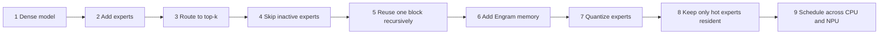

# Concepts

A visual learning path. Each step adds one mechanism and asks one
question; each page answers what problem the mechanism solves, the basic
idea, what the microscope measures, what would demonstrate value, and
which experiments exist. Pages read front to back in this order.

| Step | Question | Page | Status |
|---|---|---|---|
| 1 | How good is a tiny dense model? | [Dense versus MoE](dense-vs-moe.md) | measured (DN01) |
| 2, 3 | Can we store more model than we execute, and what does the second expert cost? | [Routing and top-k](routing.md) | measured (MX01, MX02) |
| 4 | Can conditional compute actually avoid the unused work? | [Sparse dispatch](sparse-dispatch.md) | measured (SD01, GB01) |
| 2b | How many experts can we afford? | [Low-rank delta experts](delta-experts.md) | measured (LD01) |
| 5 | Can compute replace parameters? | [Recurrence](recurrence.md) | planned |
| 6 | Can cheap lookup memory replace learned memorization? | [Engram](engram.md) | planned |
| 6b | Can a teacher improve a tiny student? | [Distillation](distillation.md) | teacher fixture exists (TE01) |
| 7 | How many experts fit in the same storage? | [Quantization](quantization.md) | projected (RB01) |
| 8 | Does the whole model need to be resident? | [Expert cache](expert-cache.md) | estimated (RB01) |
| 9 | Should every expert run on the same device? | [Heterogeneous execution](heterogeneous-execution.md) | planned |

## Four kinds of sparsity

| Sparsity | We avoid paying for | Mechanism | Where it is measured |
|---|---|---|---|
| Parameter | many unique layers | recurrence | RC01, RM01 (planned) |
| Compute | every expert on every token | top-k routing and sparse dispatch | MX01, MX02, SD01 |
| Memory lookup | reconstructing common patterns with neural weights | Engram | EG01 (planned) |
| Residency | the whole expert bank in fast memory | expert cache | XC01 (planned); RB01 gives the estimates |

## The parts and why they exist

| Part | Job | Why it matters |
|---|---|---|
| Router | chooses experts per token | activates only useful capacity |
| Experts | learn different transformations | raise stored capacity |
| Top-k | sets experts used per token | the quality-versus-compute knob |
| Load balancing | prevents expert collapse | keeps capacity usable |
| Sparse dispatch | runs only selected experts | turns sparsity into less work |
| Recurrence | reuses one block several times | more computation without more parameters |
| Engram | retrieves memorized n-gram information | moves lookup-like knowledge out of weights |
| Distillation | transfers behavior from a larger model | improves tiny-model quality |
| Quantization | shrinks expert representation | lets more experts fit in memory |
| Expert cache | keeps hot experts in fast memory | lets the model exceed fast memory |
| CPU/NPU scheduling | sends work where it fits | exploits heterogeneous hardware |
| Packed model | bounded inference artifact | tests whether the design fits constrained devices |

Metrics are grouped the same way everywhere: quality (exact match by task
family and overall), model economics (total and active parameters, bytes
per token), runtime (expert evaluations, cache hits, latency), and
diagnostics (loss, perplexity, entropy, KL, balance).
