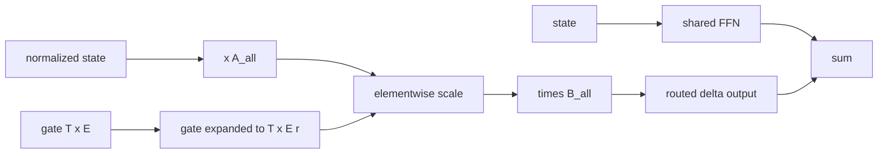

# Low-rank delta experts

## What problem does it solve?

A full expert is a whole feed-forward block (1,072 parameters here). If
each expert is instead a rank-r delta over the residual stream, A_e B_e,
sixteen experts cost less than four full ones, and a shared always-on
feed-forward block keeps the nonlinearity.

## Basic idea

All experts live in two packed matrices, A_all [d, E r] and B_all [E r, d].
The routed sum over every expert is two matmuls with the gate expanded by
a constant block one-hot, exact for any E and k.

## What the evidence says

| Configuration | Params | Active per token | Bytes per expert | Val loss |
|---|---:|---:|---:|---:|
| DN01 shared FFN only | 3,812 | 2,996 | - | 3.79 |
| MX01 four full experts | 7,096 | 3,064 | 8,576 | 3.76 |
| LD01 shared plus 16 deltas | 6,132 | 3,396 | 1,024 | 3.46 |
| LD01r 16 deltas only | 5,060 | 2,324 | 1,024 | 3.37 |

Sixteen deltas cost 2,048 parameters against 4,288 for four full experts
and gave the best validation losses in the table so far, with a noisier
training curve and no prose generalization on that run. Router cost grows
with the expert count (272 multiply-adds per token for sixteen).

## Experiments

- [LD01 low-rank delta experts](../experiments/LD01.md)
