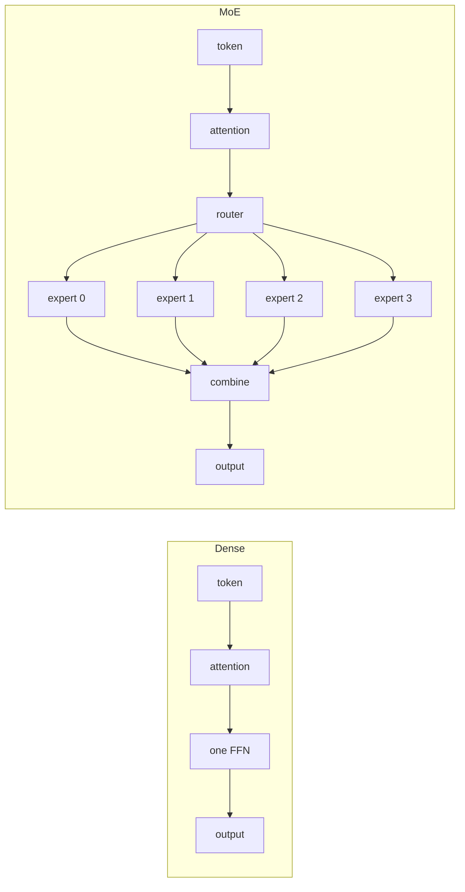

# Dense versus mixture of experts

## What problem does it solve?

A dense block spends every parameter on every token. Capacity and compute
grow together. A mixture of experts stores several feed-forward blocks and
runs only the chosen ones, so stored capacity can grow while the work per
token stays roughly constant.

## Basic idea

## What the microscope measures

Total parameters, active parameters per token, bytes per token, validation
masked loss, exact match per family, and (for the mixture) per-expert load
over training.

## What the evidence says

| | DN01 dense | MX01 top-1 of 4 |
|---|---:|---:|
| Total parameters | 3,812 | 7,096 |
| Active per token | 2,996 | 3,064 |
| Validation loss | 3.79 | 3.76 |
| Prose exact match, held out | 0.667 | 0.667 |

Stored capacity grew 1.86 times for 1.02 times the active parameters at
the same validation loss. That is the mechanism working; it is not yet a
quality win at this scale (DS01 shows the data needed for one).

## Experiments

- [DN01 dense baseline](../experiments/DN01.md)
- [MX01 top-1 mixture](../experiments/MX01.md)
- [DS01 data scale](../experiments/DS01.md) for both models against data size

## On the landscape

Watch the data move: tokens, embedding, and attention (scenes 1 and 2), and the head (scene 8) on the
[panned animation](https://sw-ml-study.github.io/moe-microscope/landscape.html?scene=0), every chip value read from the
pinned recordings.

## Deeper reference

- [Resource economics](../results/resource-economics.md)
- [Results table](../reference/results.md)
