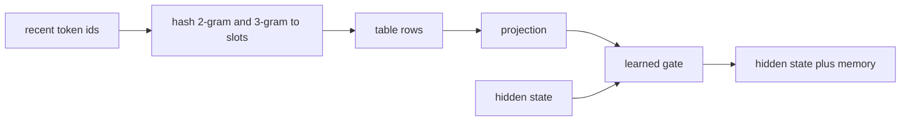

# Engram

## What problem does it solve?

Neural weights spend capacity reconstructing common local patterns. Engram
(DeepSeek) moves that memorization into a deterministic lookup: hash the
last two or three token ids, read a learned vector from a table, project
it, and add it to the hidden state through a learned gate.

## Basic idea

You choose the n-gram orders, the slot count, the value width, and the
layer; what the slots contain is learned. The table size is a design
choice; the data sets how many distinct n-grams want storage; the ratio
sets collisions. Our 52-symbol domain has at most 2,704 distinct 2-grams,
so 256 to 1,024 slots suffice at microscope scale while the lab scale uses
65,536.

## Engram is not an n-gram model

An n-gram language model counts how often a token follows the previous
n-1 tokens and predicts the next token from those counts: a table of
probabilities indexed by exact context, with smoothing for contexts it
never saw, and no network. Engram borrows only the addressing. The
previous one or two tokens (2-gram and 3-gram contexts) are hashed to
rows of a fixed-size table, but a row holds a learned vector, not a
count; the vector is gathered, projected to the hidden width, and added
to the residual stream through a gate that the hidden state controls.
What the rows contain is set by backpropagation from the language loss,
and the output is a contribution to the network's state, not a
prediction. Two consequences: the table can be far smaller than the
number of contexts (collisions are a design parameter, not an error), and
the network decides per position how much of the retrieved memory to use.

## What the microscope will measure

Which slots become nonzero and how strong the gate is (`engram_stats`);
collisions, gate magnitude, and prose accuracy against a slot-count sweep;
parity between a from-scratch MLPL Engram and the sw-MLPL builtin.

## What would demonstrate value

Same neural parameters, better recall of local patterns: prose held out
should be the first family to move.

## What the evidence says

EG01 (the DN01 block plus a 2-gram and 3-gram table, 8 values per row,
four table sizes and the builtin form, one process each): the
hand-written form and the `engram` builtin are the same function (zero
difference in outputs and gradients on trained parameters). At 90
training windows the table is memorization capacity: training loss falls
below DN01's and validation loss rises above it at every size (3.93 at
1,024 slots to 4.67 at 256, against 3.79), the gate opens to 0.5 to 0.74,
and prose held-out accuracy keeps DN01's 0.667 only at 1,024 slots.
Collisions grow from 161 of 769 contexts at 1,024 slots to 737 at 16.
The prediction that prose moves first did not hold at this data size.

RE01 composes the table with the recurrent mixture (all three
sparsities): validation loss 4.60 with routing and 4.76 with routing and
recurrence, training loss 0.006; the mechanisms compound memorization at
this data size rather than complement each other.

## Is it worth it?

The quantified answers are the EG01 table (four table sizes: collisions,
rows addressed, gate mean, validation loss, prose held-out), the RE01
ablation matrix (the table alone, with routing, with routing and
recurrence), and [finding 10](../results/current-findings.md).

| Verdict | Condition | Evidence here |
|---|---|---|
| Never, at this scale | 90 training windows, 52 symbols, the table trained with the block | every size raises validation loss (3.93 at 1,024 slots to 4.67 at 256, against 3.79 without) and lowers training loss; composed with routing 4.60, with routing and recurrence 4.76; the only held-out family that survives is prose at the largest table, at the same 0.667 as without the table |
| Sometimes, untested | enough data that held-out contexts recur in training (DS01: 480 and 960 examples turn prose into a solved family), a frozen base block so the table cannot co-adapt, a larger vocabulary where n-gram recall is worth more than a 16-wide block can learn | no measurement yet; these are the next candidates named in EG01 and RE01 |
| Always | - | nothing here supports it; the cost is 816 active parameters per token plus the table bytes at every size |

What the table does buy at any size is verified mechanism: the
hand-written form equals the builtin to the bit, only addressed rows
move, and collisions behave as the hash contract predicts. The value
question stays open until the data-scale point is measured.

## Why it has not paid off here, and how it could

Why not: the table is written by the same gradient that trains the
block, on 90 windows whose held-out prompts share few exact 2-gram and
3-gram contexts with training rows beyond the prose template. Under
those conditions the cheapest way to lower the training loss is to write
each training answer into the rows its context addresses, which the
gate then admits (it opens from 0.12 to about 0.7), and nothing forces
the rows to hold anything a held-out context can use. The context length is not the limit: a 2-gram or 3-gram context is two
or three tokens, and every window holds them; nor does distillation add
data, since the in-repo teacher (TE01) saw the same 90 rows and is
itself worse held out (4.14). DeepSeek's setting
differs on every count: billions of tokens, a vocabulary of thousands,
tables of hundreds of thousands of rows, and a base model whose local
recall the table offloads.

How it could pay off, in the order we can test:

1. More data (EG02, queued in the frontier saga, and SE01 in Saga 9 at 480 examples): the DS01 harness already trains at 480 and
   960 examples, where prose becomes a solved family and arithmetic
   starts to move; adding the table there asks whether recall of
   recurring contexts helps once contexts recur.
2. A frozen base (also EG02): train the dense block first, freeze it, and
   train only the table, projection, and gate, the upstream frozen-base
   recipe; the table then cannot co-adapt with the block and must earn
   its gate.
3. A yardstick (NG01, planned): a count-based n-gram predictor on the
   same domain says how much of the held-out set pure context recall can
   answer at all; if that number is near zero for every family but prose,
   no memory layer can beat it there, and the domain, not the mechanism,
   is the limit.
4. A domain with more recurring local structure (more prose templates, a
   byte-level vocabulary), where the plan's lab scale (65,536 slots, 32
   values) is meant to run.

## Which n-gram order?

Reports on Engram-style memory find the most value around order 4
rather than 2, 3, or 5, and that is domain and text dependent: the
order that pays is the one whose contexts recur often enough to be
learned and are long enough to disambiguate. Our lessons use orders 2
and 3 (the builtin's default pairing); nothing here has measured the
order. Both planned experiments sweep it: NG01 fits the count model at
orders 1 to 5 and plots exact match by family and perplexity against
order, and EG02 trains the table with orders 2, 3, 4, and 5 alone and in
pairs (the `engram` builtin and `lib/engram.mlpl` accept any order list)
and plots validation loss, prose accuracy, and collisions against order
at a fixed table size. On this domain a 4-gram sees `on the` plus the
verb in a prose prompt and `=|` plus two digits in arithmetic, so the
prediction is that order 4 helps prose most and arithmetic not at all;
the sweep says whether that holds.

## Is there value in an n-gram experiment?

Yes, as a yardstick, not as a component: NG01 would fit a 2-gram and
3-gram count model with simple backoff on the training windows, decode
the held-out prompts greedily, and report the same per-family exact
match and a perplexity, for a few minutes of interpreter time. It sets
the floor that any memory mechanism must beat, exactly as the matcher
baseline did for the docent, and it tells us whether the failure of the
table at 90 windows is a failure of the table or of the data. It is not
worth building into the model: a count table cannot be gated or trained
with the block, which is the whole point of Engram.

## Engram and multi-token prediction

They are different mechanisms and they compose. Engram reads memory into
the hidden state: its output is a vector added to the residual stream,
never a token. Multi-token prediction (MTP, DeepSeek-V3) adds a small
module that predicts the token after next from the same hidden state
during training, a denser training signal, and at inference that module
can draft a token that the main head then verifies, which is speculative
decoding with the draft built in. So the draft model of speculative
decoding and an MTP head both produce candidate tokens for the final
model to accept or reject; Engram produces no tokens and sits on the
input side of the block. A model can have both: the MTP module reads the
same Engram-enriched state.

Plan: MT01 to MT03 (Saga 10) add a second head that predicts position t+2 with the deep
supervision machinery of RC01, measures the main head's validation loss
with and without the auxiliary loss, then uses the second head as a
draft and measures the acceptance rate and tokens per forward pass on
the generation benchmark. The landscape's multi-token station is its
placeholder.

## Status

EG01 and RE01 measured; the saga closes next. Engram at more data (480 and 960 examples)
and with a frozen dense block are the open candidates.

## On the landscape

Watch the data move: the Engram lookup (scene 3) and the composition (scene 7) on the
[panned animation](https://sw-ml-study.github.io/moe-microscope/landscape.html?scene=2), every chip value read from the
pinned recordings.

## Deeper reference

- [How Engram is sized](../research/moe-engram-discussion.md)
