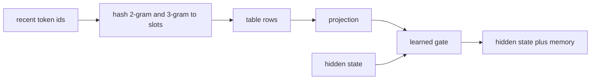

# Engram

## What problem does it solve?

Neural weights spend capacity reconstructing common local patterns. Engram
(DeepSeek) moves that memorization into a deterministic lookup: hash the
last two or three token ids, read a learned vector from a table, project
it, and add it to the hidden state through a learned gate.

## Basic idea

You choose the n-gram orders, the slot count, the value width, and the
layer; what the slots contain is learned. The table size is a design
choice; the data sets how many distinct n-grams want storage; the ratio
sets collisions. Our 52-symbol domain has at most 2,704 distinct 2-grams,
so 256 to 1,024 slots suffice at microscope scale while the lab scale uses
65,536.

## What the microscope will measure

Which slots become nonzero and how strong the gate is (`engram_stats`);
collisions, gate magnitude, and prose accuracy against a slot-count sweep;
parity between a from-scratch MLPL Engram and the sw-MLPL builtin.

## What would demonstrate value

Same neural parameters, better recall of local patterns: prose held out
should be the first family to move.

## What the evidence says

EG01 (the DN01 block plus a 2-gram and 3-gram table, 8 values per row,
four table sizes and the builtin form, one process each): the
hand-written form and the `engram` builtin are the same function (zero
difference in outputs and gradients on trained parameters). At 90
training windows the table is memorization capacity: training loss falls
below DN01's and validation loss rises above it at every size (3.93 at
1,024 slots to 4.67 at 256, against 3.79), the gate opens to 0.5 to 0.74,
and prose held-out accuracy keeps DN01's 0.667 only at 1,024 slots.
Collisions grow from 161 of 769 contexts at 1,024 slots to 737 at 16.
The prediction that prose moves first did not hold at this data size.

RE01 composes the table with the recurrent mixture (all three
sparsities): validation loss 4.60 with routing and 4.76 with routing and
recurrence, training loss 0.006; the mechanisms compound memorization at
this data size rather than complement each other.

## Status

EG01 and RE01 measured; the saga closes next. Engram at more data (480 and 960 examples)
and with a frozen dense block are the open candidates.

## Deeper reference

- [How Engram is sized](../research/moe-engram-discussion.md)
