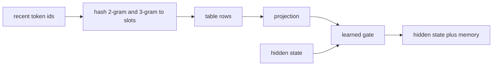

# Engram

## What problem does it solve?

Neural weights spend capacity reconstructing common local patterns. Engram
(DeepSeek) moves that memorization into a deterministic lookup: hash the
last two or three token ids, read a learned vector from a table, project
it, and add it to the hidden state through a learned gate.

## Basic idea

You choose the n-gram orders, the slot count, the value width, and the
layer; what the slots contain is learned. The table size is a design
choice; the data sets how many distinct n-grams want storage; the ratio
sets collisions. Our 52-symbol domain has at most 2,704 distinct 2-grams,
so 256 to 1,024 slots suffice at microscope scale while the lab scale uses
65,536.

## What the microscope will measure

Which slots become nonzero and how strong the gate is (`engram_stats`);
collisions, gate magnitude, and prose accuracy against a slot-count sweep;
parity between a from-scratch MLPL Engram and the sw-MLPL builtin.

## What would demonstrate value

Same neural parameters, better recall of local patterns: prose held out
should be the first family to move.

## Status

Planned: EG01 and RE01 in the recurrence-and-Engram saga. sw-MLPL already
ships `ngram_hash`, `engram`, `apply_engram`, and `engram_stats`.

## Deeper reference

- [How Engram is sized](../research/moe-engram-discussion.md)
