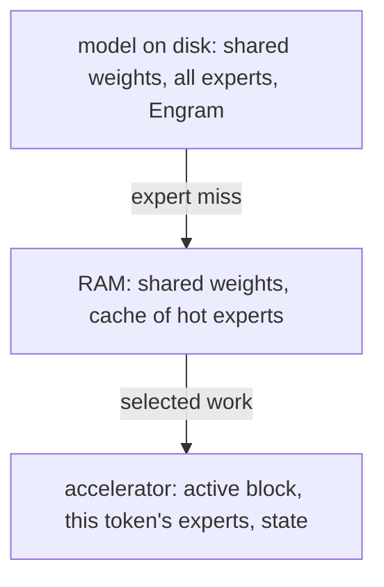

# Expert cache

## What problem does it solve?

A model may hold more expert weights than fast memory. FreeToken keeps
non-expert weights on the accelerator, the full expert pool in host RAM,
and an LRU cache of hot experts that follows the router's recent choices.

## Basic idea

## What the microscope will measure

Expert size and statistics, resident experts, hit rate, misses and bytes
loaded per token, load latency and compute latency per token, and the
storage-to-resident ratio; deterministic counts first, machine-dependent
timings second.

## What the estimates already say

At these sizes latency dominates bytes: an HDD miss costs about 8 ms
against a generated token of 0.16 to 0.5 ms (GB01), a SATA SSD miss
about 0.08 ms, and a RAM fetch about 0.5 microseconds. A
cache is about avoiding storage latency. The current four-expert model is
fully resident, so XC01 will build a large bank of tiny experts (256
experts with an 8-expert cache is 19 to 1 stored to resident) to make
locality matter.

## Status

Planned: XC01 in the quantization, packing, and cache saga.

## Deeper reference

- [Resource economics](../results/resource-economics.md), sections 5 and 6
