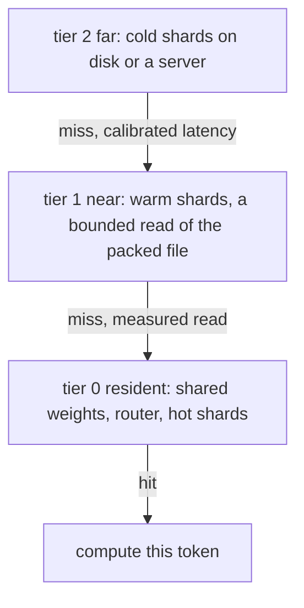

# Tiered weight residency

## What problem does it solve?

A model may hold more weight than fast memory. FreeToken keeps non-expert
weights on the accelerator, the full expert pool in host RAM, and an LRU
cache of hot experts that follows the router's recent choices. The same
question appears wherever weights outgrow the fastest place to put them,
and the answer always has the same shape: what is resident, what is one
level away, and what does a miss cost.

## Basic idea

The residency unit is a **shard record**, not an expert. In the microscope
a shard is one padded expert in the packed file; in
[`sw-atlas`](../implementation/cross-repo-handoffs.md) it is a depth shard
of an encoder or decoder stack; in a browser the same three tiers are the
WASM heap, OPFS, and an HTTP range request. One LRU and one trace serve
all of them, which is the point: the policy question does not care what is
inside the record.

## What the microscope will measure

Shard size and statistics, resident shards, hit rate, misses and bytes read
per token, load latency and compute latency per token, evictions, and the
storage-to-resident ratio; deterministic counts first, machine-dependent
timings second, and each number labelled measured, derived, or estimated.
TW01 also replays a foreign manifest through the same simulator, and
labels its trace with each shard's true next use so that known-next-use
can be compared with LRU on the same capacity sweep.

## What the estimates already say

At these sizes latency dominates bytes: an HDD miss costs about 8 ms
against a generated token of 0.16 to 0.5 ms (GB01), a SATA SSD miss
about 0.08 ms, and a RAM fetch about 0.5 microseconds. A
cache is about avoiding storage latency. The current four-expert model is
fully resident, and one expert is 536 bytes at INT4, far too small for a
storage hierarchy to show a cost. TW01 therefore builds a large bank of
padded shard records (256 experts with an 8-shard resident set is 19 to 1
stored to resident) so that locality matters and a read is a real read.

## Status

Planned: TW01 in the quantization, packing, and residency saga, with the
packed file's shard directory (PK01) underneath it.

## Deeper reference

- [Resource economics](../results/resource-economics.md), sections 5 and 6
- [Delivery plan](../overview/plan.md), Saga 14
- [Cross-repository handoffs](../implementation/cross-repo-handoffs.md),
  the sw-atlas section
