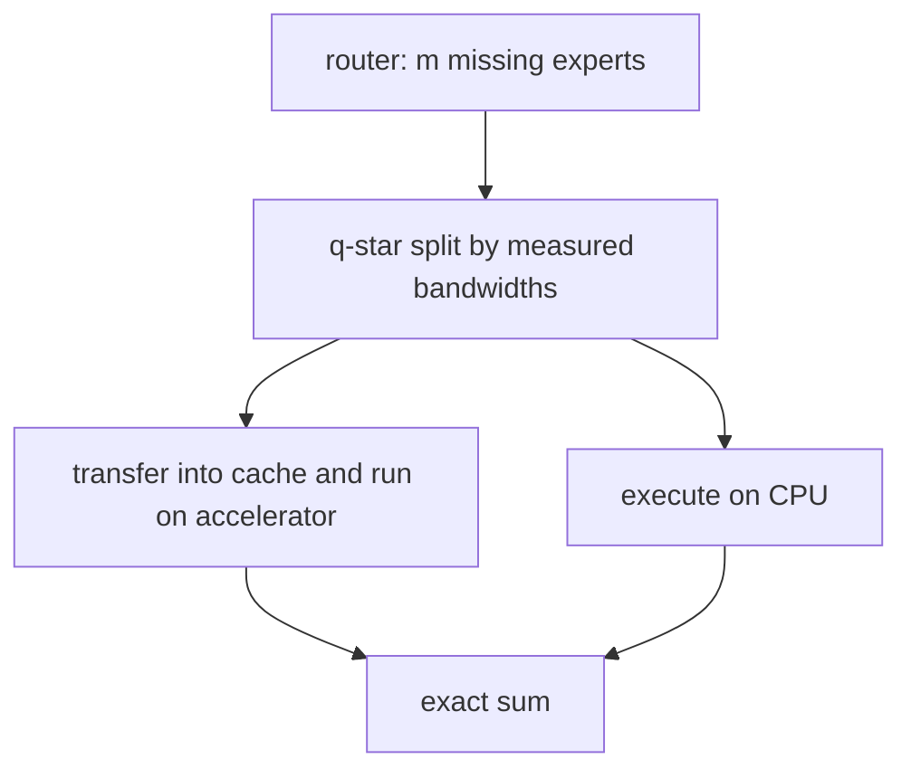

# Heterogeneous execution

## What problem does it solve?

When several experts miss the cache, transferring all of them or executing
all of them on the CPU are both wrong. FreeToken measures the transfer
bandwidth and the host compute bandwidth and splits the missing experts
between the two so both finish together; the partial outputs sum exactly.

## Basic idea

## What the microscope will measure

Calibrated bandwidths, tokens per second against the transfer-only and
compute-only policies, bytes moved, and expert-bank dispatch counts.

## Status

Planned: HY01 in the hybrid execution saga, then made real on a CUDA
machine with expert weights in host RAM in the CUDA saga.
