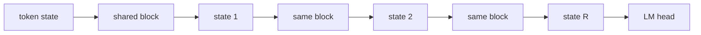

# Recurrence

## What problem does it solve?

Depth normally costs parameters: each layer is new weights. HRM and TRM
show that reasoning depth can come from applying one small block several
times. One physical block, R recurrences, with deep supervision so each
intermediate state is rewarded for improving the answer.

## Basic idea

In the recurrent mixture, each recurrence re-routes, so the same token can
change experts between steps: routing over reasoning time.

## What the microscope will measure

Accuracy against recurrence depth R at fixed parameters; the expert chosen
per token per recurrence; the change-of-expert statistic; cost per token
as R grows.

## What would demonstrate value

Same parameters, better held-out exact match at some R greater than 1.

## Status

Planned: RC01 and RM01 in the recurrence-and-Engram saga. Upstream sw-MLPL
now traces `repeat` with literal and parameter-bound counts (findings F6
and F15, resolved), so depth can be a function argument.

## Deeper reference

- [Delivery plan](../overview/plan.md), the recurrence-and-Engram saga
