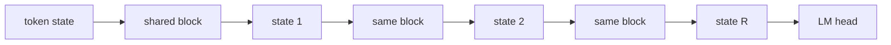

# Recurrence

## What problem does it solve?

Depth normally costs parameters: each layer is new weights. HRM and TRM
show that reasoning depth can come from applying one small block several
times. One physical block, R recurrences, with deep supervision so each
intermediate state is rewarded for improving the answer.

## Basic idea

In the recurrent mixture, each recurrence re-routes, so the same token can
change experts between steps: routing over reasoning time.

## What the microscope will measure

Accuracy against recurrence depth R at fixed parameters; the expert chosen
per token per recurrence; the change-of-expert statistic; cost per token
as R grows.

## What would demonstrate value

Same parameters, better held-out exact match at some R greater than 1.

## What the evidence says

RC01 (one block, deep supervision, 3,812 parameters at every R, one process
per R): validation loss 3.79 at R=1 (DN01 exactly), 3.45 at R=2, 3.73 at R=3
with the first held-out MLPL answers of a dense model, 4.22 at R=4. Every
model scores best when stopped after its first recurrence (3.29 for the R=2
model), so the gain is a regularization effect of scoring every state, not
a converging reasoning loop. One seed, 90 windows.

RM01 (the MX01 mixture block reused, the router run at every recurrence,
7,096 parameters at every R): 46 percent (R=2) and 38 percent (R=3) of
tokens change expert between consecutive recurrences, so the recurrences
are new routing decisions. The R=3 mixture reaches validation loss 3.42,
the lowest of any 120-example model in the results table, with the lowest
training exact match (0.43); R=2 is worse than the single application
(4.09 against 3.76). Specialization is strongest at the first recurrence
(0.65) and weaker after it (0.45, 0.49). One seed.

With the Engram table in the loop (RE01) the recurrent mixture reaches
training loss 0.006 and validation loss 4.76, the worst of the seven-row
ablation: recurrence gives the table more compute to memorize with.

## Status

RC01, RM01, and RE01 measured; the ablation matrix is in the RE01 report. sw-MLPL traces `repeat` with literal and
parameter-bound counts (findings F6 and F15, resolved), so depth is a
function argument.

## Deeper reference

- [Delivery plan](../overview/plan.md), the recurrence-and-Engram saga
