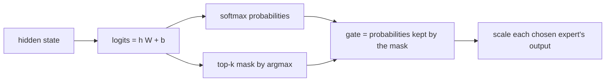

# Routing and top-k

## What problem does it solve?

Something has to decide, per token, which experts run. The router is one
small linear layer over the hidden state; its scores are the whole
decision, and top-k keeps the k largest.

## Basic idea

The pick itself has no gradient, so the gate keeps the chosen expert's
probability as a factor (Switch style). If raising that probability would
lower the loss, the router raises it. A load-balance term (1.0 when even)
stops one expert from taking every token.

## What the microscope measures

Router logits, probabilities, masks, and gates for a fixed batch
(the [routing diagram](../../assets/previews/router-routing.svg)); per-expert
load, router entropy, and balance over training; the family-by-expert map
and its specialization score; expert evaluations per token.

## What the evidence says

- Top-1 specialization score 0.61 against a 0.25 family-blind baseline,
  with no family label shown to the router ([MX02](../experiments/MX02.md)).
- Top-2 doubles expert evaluations, fits training rows better (0.86 against
  0.62 exact match), gives the first held-out MLPL answers, and has a worse
  validation loss (3.92 against 3.76) and a flatter map (0.42).
- Loads stayed spread under balance weight 0.01 (208, 30, 47, 121 of 406
  tokens for MX01).

Scope: the four synthetic families are deliberately separable, so this
shows that specialization can emerge when the task distribution has latent
structure, not that it emerges in ordinary text.

## Experiments

- [MX01 routing](../experiments/MX01-routing.md) (before training)
- [MX01 top-1](../experiments/MX01.md), [MX02 top-2](../experiments/MX02.md)

## Deeper reference

- [How experts specialize, how routing decides](../research/moe-engram-discussion.md)
