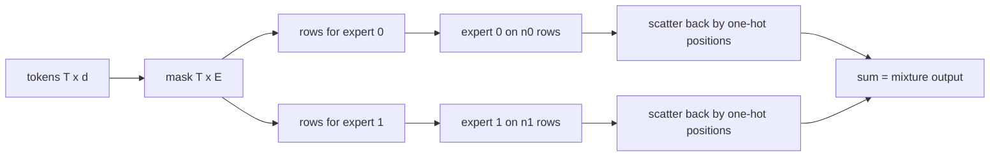

# Sparse dispatch

## What problem does it solve?

Dense-masked training evaluates every expert and lets the gate zero the
unchosen ones; the mathematics is sparse but the work is not. Sparse
dispatch gathers each expert's routed tokens, runs the expert once on that
sub-batch, scales by the gate, and scatters the outputs back.

## Basic idea

## What the microscope measures

Maximum output difference between the two paths, expert row evaluations,
parameters touched per token, and interpreter time per window.

## What the evidence says

Exactly equal outputs (maximum difference 0 over 120 windows); 3,360
expert row evaluations against 13,440; 3,064 parameters touched per token
against 6,280. And slower in the interpreter: 0.74 against 0.42 ms per
window, because gather, scatter, and loop overhead exceed three 16-by-32
matmuls. Reduced work does not automatically mean reduced latency; that is
what real inference systems need batching, fusion, and large enough
experts for.

## Experiments

- [SD01 sparse dispatch](../experiments/SD01.md)
- [GB01 generation benchmark](../experiments/GB01.md): the same cost per
  generated token

## Deeper reference

- [Results table](../reference/results.md), SD01 row
