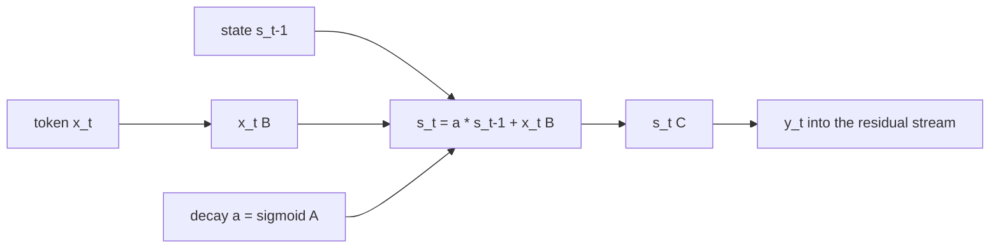

# State-space block

## What problem does it solve?

Attention carries context by keeping every earlier token's key and value,
so decode memory grows with the window and every new token reads all of
it. A state-space block (Mamba, Mamba-2) carries context in a fixed-size
state that is updated once per token and decays selectively: memory per
token is constant, and the block chooses, from the token itself, what to
keep and what to forget. NVIDIA's Nemotron-H and Nemotron 3 Nano interleave
such blocks with a few attention blocks and MoE feed-forward blocks, keeping
attention's exact recall where it matters and constant-memory context
everywhere else.

## Basic idea

The simple block (SS01) written out: `s_t = a * s_(t-1) + x_t B` and
`y_t = s_t C`, with `a = sigmoid(A)` a learned decay per state dimension
held in 0 to 1, and `B`, `C` small projections. The selective block (SS02)
makes the decay and the input gate functions of the token: `a_t =
sigmoid(x_t Wa)`, `b_t = x_t Wb`. At microscope scale the scan runs
sequentially over the 28-position window as one `repeat` per position;
`probes/c1_selective_scan_in_grad.mlpl` shows the form traces through
`grad` and trains with `adam`, and `lib/ssm.mlpl` is the lesson's version.

## What the microscope measured

SS01 is DN01 with attention replaced by the simple scan at matched size
(1,056 parameters against 1,024), trained with the DN01 budget:

| | SS01 scan | DN01 attention |
|---|---:|---:|
| Validation loss | 4.56 | 3.79 |
| Held-out exact match, arith / seq / mlpl / prose | 0 / 0 / 0.286 / 0.667 | 0 / 0 / 0 / 0.667 |
| Training exact match | 0.99 | 0.70 |
| Persistent state at 1,024 tokens of history | 256 B | 262,144 B |
| Prefill, microseconds per token at 1,024 tokens (interpreter) | 42.3 | 16.0 |

The learned decay spans 0.26 to 0.98 (mean 0.76): about a third of the
first position of a seven-token window is still in the state at its end.
The [SS01 report](../experiments/SS01.md) has the full rows and the three
diagrams (structure and bytes, the state along one window as fading chips,
state bytes against history).

Did a fixed-size state learn anything here? It learned the training rows
at least as well as attention (better exact match, lower training loss)
and generalized worse (validation loss 4.56 against 3.79, the same prose
answers, one more MLPL answer). What it costs: nothing in memory, exactly
256 bytes at any history where attention holds 256 bytes per token; and,
in this interpreter, two to eight times the prefill microseconds per
token, because a sequential scan is one interpreter step per position
while attention is one matmul over the window.

## What would demonstrate value

At matched parameters, the scan block within a small margin of attention's
validation loss with constant decode memory; and a hybrid ratio that keeps
attention's held-out MLPL answers (the first ones came from RC01 and RM01)
while the state-space blocks carry the rest at lower bytes per token. SS01
delivers the constant memory and not the margin; SS02 (selective gating)
and HA01 (one attention block among state blocks) are the next two rows.

## Status

Saga 7 (state-space-and-hybrid) is in progress: SS01 is measured (this
page's table); SS02 selective, HA01 with attention, SM01 with experts, and
LM01 latent experts follow. The results table carries a state-bytes column
for every row from SS01 on.

## Deeper reference

- [SS01 report](../experiments/SS01.md) and the
  [results table](../reference/results.md)
- [Delivery plan](../overview/plan.md), Saga 7, and
  [`research4.txt`](../research/research4.txt)
- [Recurrence](recurrence.md) for the depth-without-parameters machinery
  the hybrid reuses
