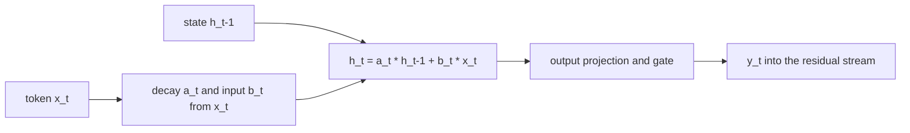

# State-space block

## What problem does it solve?

Attention carries context by keeping every earlier token's key and value,
so decode memory grows with the window and every new token reads all of
it. A state-space block (Mamba, Mamba-2) carries context in a fixed-size
state that is updated once per token and decays selectively: memory per
token is constant, and the block chooses, from the token itself, what to
keep and what to forget. NVIDIA's Nemotron-H and Nemotron 3 Nano interleave
such blocks with a few attention blocks and MoE feed-forward blocks, keeping
attention's exact recall where it matters and constant-memory context
everywhere else.

## Basic idea

The selective scan written out: `h_t = a_t * h_(t-1) + b_t * x_t`, with
`a_t = sigmoid(x_t Wa)` (per-dimension decay in 0 to 1) and `b_t = x_t Wb`
(per-dimension input gate), then `y_t = h_t Wo` gated by the token. At
microscope scale the scan runs sequentially over the 28-position window;
`probes/c1_selective_scan_in_grad.mlpl` shows it traces through `grad`
and trains with `adam` today.

## What the microscope will measure

SS01: DN01 with attention replaced by the scan at matched parameters:
validation loss and family accuracy; the decay `a_t` per position on one
window (what the block forgets, drawn as a fading state chip); decode-time
bytes held per token for the state against the key-value cache attention
would hold, on the generation benchmark. SS02: the attention, state-space,
and MoE hybrid at several ratios, with the recurrence machinery for depth.

## What would demonstrate value

At matched parameters, the scan block within a small margin of attention's
validation loss with constant decode memory; and a hybrid ratio that keeps
attention's held-out MLPL answers (the first ones came from RC01 and RM01)
while the state-space blocks carry the rest at lower bytes per token.

## Status

Planned as Saga 7 (state-space-and-hybrid), next after the landscape:
SS01 simple, SS02 selective, HA01 with attention, SM01 with experts, LM01
latent experts. Nothing measured yet; the only evidence is the capability
probe.

## Deeper reference

- [Delivery plan](../overview/plan.md), Saga 7, and
  [`research4.txt`](../research/research4.txt)
- [Recurrence](recurrence.md) for the depth-without-parameters machinery
  the hybrid reuses
