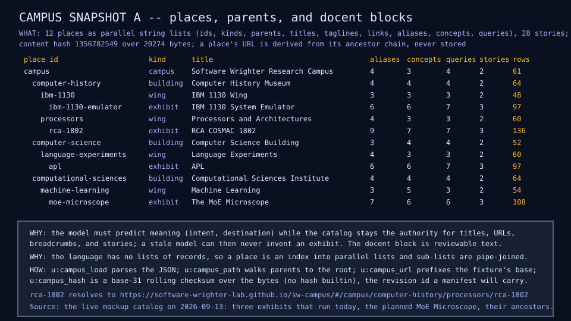
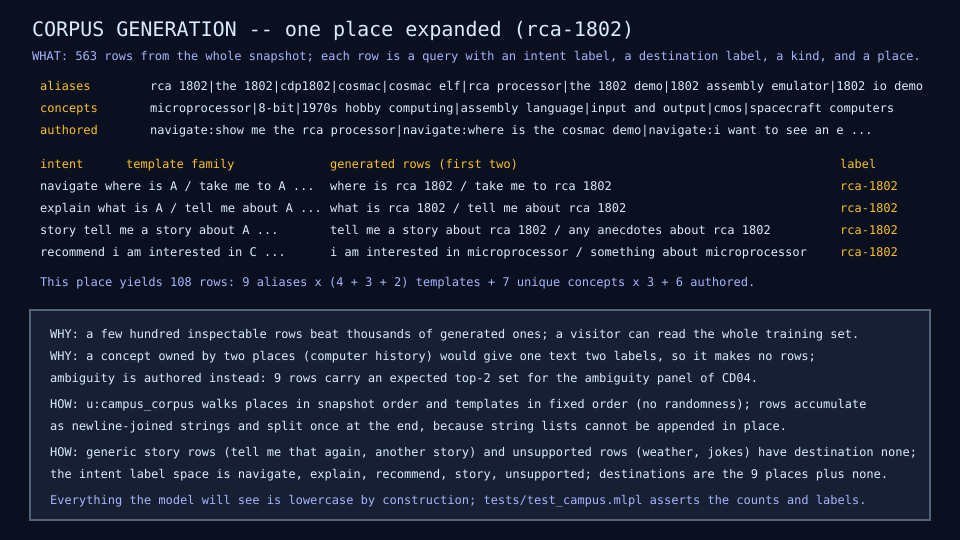
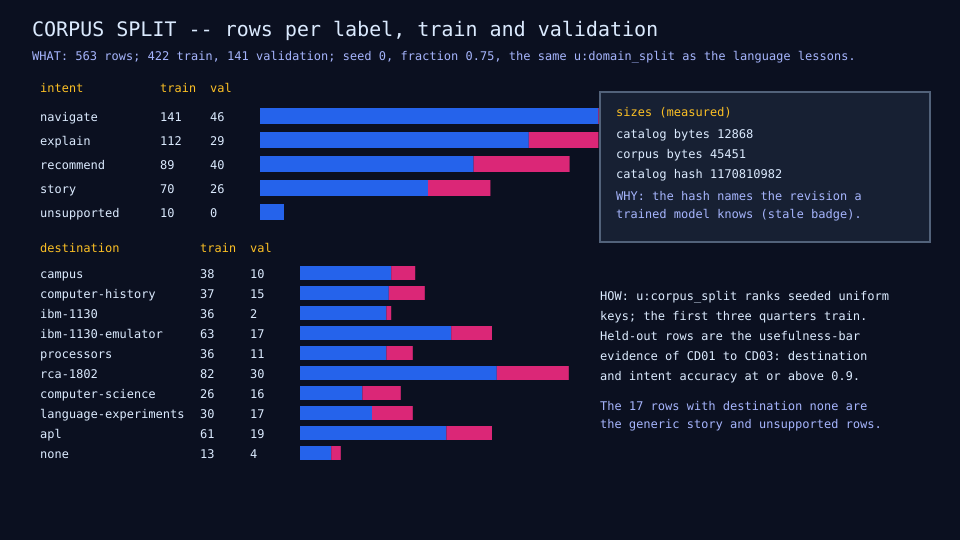
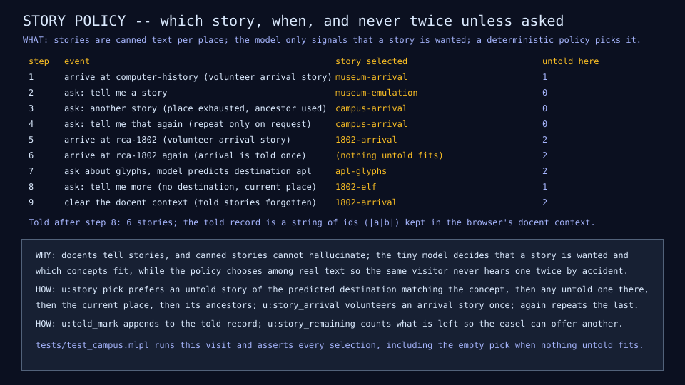

# CD00: campus snapshot A and the docent corpus

## Question

What does the campus docent see, and is its training set honest,
inspectable, and reproducible from the campus catalog?

## Change from the previous experiment

A second training area. The domain is no longer synthetic: it is a
snapshot of the live Software Wrighter campus catalog, reduced to the three
exhibits that exist today and their ancestors, with a reviewable docent
block per place (aliases, concepts, authored queries, canned stories).

## Configuration

| Quantity | Value |
|---|---:|
| Places (campus, 2 buildings, 3 wings, 3 exhibits) | 9 |
| Stories (2 or 3 per place; arrival, feature, detail, anecdote) | 21 |
| Catalog bytes | 12,868 |
| Corpus rows | 563 |
| Training / validation rows (seed 0, fraction 0.75) | 422 / 141 |
| Corpus bytes | 45,451 |
| Intent labels | navigate, explain, recommend, story, unsupported |
| Destination labels | the 9 places plus none |

Destinations that exist today: the IBM 1130 system emulator, the RCA COSMAC
1802 (assembly emulator and I/O demo), and APL on COR24. The IBM 1442 and
its radio demo are excluded on purpose; they are the new-knowledge event of
the v1 saga.

## Results

Rows per intent: navigate 187, explain 141, recommend 129 (9 of them
authored ambiguous rows carrying an expected top-2 set), story 96 (7 generic
rows such as "tell me that again"), unsupported 10. Corpus generation takes
about 0.13 s in the interpreter. The catalog hash of snapshot A is
1170810982 (a base-31 rolling checksum; the language has no hash builtin).









## What we learned

- The catalog can be the corpus. A deterministic generator over a few
  hundred reviewable rows gives every alias, concept, and authored question
  a label without any randomness, and the whole training set fits on a
  screen.
- Shared concepts must not generate rows (one text, two labels); ambiguity
  is authored explicitly instead, which is what the CD04 panel needs.
- The story policy is a small deterministic function over the catalog and a
  told record: arrival once, untold first (destination and concept, then
  the current place, then ancestors), repeat only on request. The model only
  has to say that a story is wanted.
- Language constraints shaped the data structure: no lists of records, no
  string-list append, no lowercase or hash builtin. Parallel string lists
  with pipe-joined sub-lists, join-then-split accumulation, lowercase by
  construction, and a rolling checksum cover all four.

## What we did not prove

Nothing about a model yet: CD01 trains the first classifier on these rows.
Whether 563 templated rows generalize to how visitors actually phrase
questions is exactly what the held-out split and the authored rows will
measure.

## Raw evidence

```sh
just campus          # run the demo and check the diagrams, fixture, and row
just campus write    # regenerate them
just tests tests/test_campus.mlpl
```

Fixture: [`fixtures/campus/snapshot-a.json`](../../fixtures/campus/snapshot-a.json)
(source), [`fixtures/campus/corpus-a.json`](../../fixtures/campus/corpus-a.json)
(generated, gate-checked). Code: [`lib/campus.mlpl`](../../lib/campus.mlpl),
[`demos/campus_corpus.mlpl`](../../demos/campus_corpus.mlpl),
[`tests/test_campus.mlpl`](../../tests/test_campus.mlpl). Row: CD00 in the
[results table](../reference/results.md).
