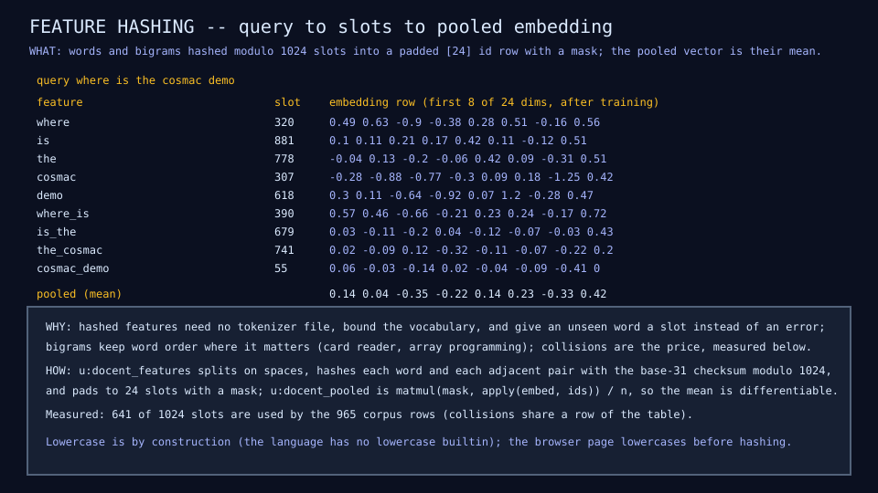
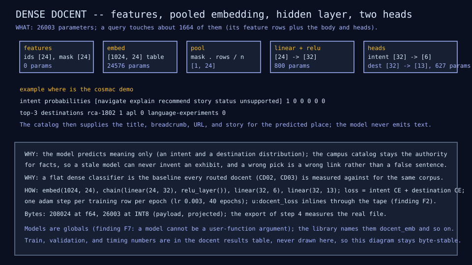
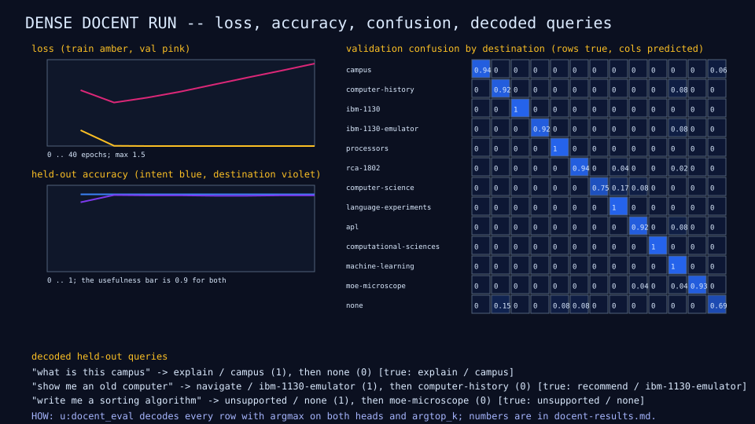

# CD01: docent dense classifier

## Question

How well does a flat dense classifier, trained in batch on the campus
corpus, predict what a visitor wants and where to send them, and what
does it fail at?

## Change from the previous experiment

The first model over the CD00 corpus: hashed word and bigram features
pooled into a learned embedding, one hidden layer, an intent head and a
destination head. No experts, no router.

## Configuration

| Quantity | Value |
|---|---:|
| Hash slots / padded features per query | 1,024 / 24 |
| Embedding width / hidden width | 24 / 32 |
| Intent labels / destination labels | 6 / 13 |
| Parameters (embedding 24,576, body 800, heads 627) | 26,003 |
| Active parameters per query (mean 9.9 features) | 1,664 |
| Bytes at f64 / INT8 (projected) | 208,024 / 26,003 |
| Training rows / epochs / learning rate | 724 / 40 / 0.003, one Adam step per row |
| Training time (interpreter) | about 46 s |

Chosen from a sweep of learning rate, epochs, slots, and width: 512 slots
reached 0.897 destination accuracy, 1,024 slots 0.913 to 0.925 depending on
the corpus revision, and width 32 added no accuracy for 8,000 more
parameters. Slots used by the corpus: 641 of 1,024.

## Results

Held-out rows are the 241 validation rows of the corpus (same templates as
training) and the 54 paraphrases (no alias verbatim, never trained on).

| Metric | Value | Where |
|---|---:|---|
| Validation loss | 1.50 | CD01 row |
| Intent accuracy | 0.938 | CD01 row |
| Destination accuracy | 0.925 | CD01 row |
| Top-3 destination accuracy | 0.963 | CD01 row |
| Exhibit accuracy (the three exhibits that run today) | 0.927 | CD01 row |
| Ambiguous rows with the expected top-2 set | 0.091 | CD01 row |
| Unsupported recall (10 held-out off-topic rows) | 0.3 | CD01 row |
| Paraphrase destination accuracy | 0.296 | CD01 row |
| Paraphrase intent accuracy | 0.481 | CD01 row |
| Inference per query (interpreter) | 0.91 ms | CD01 row |







## What we learned

- On phrasings that share the training templates the flat classifier is
  above the 0.9 bar for both heads. That is the easy part: a deterministic
  alias matcher is expected to score near 1.0 on the same rows, which is
  why the bar also demands a margin on paraphrases.
- On paraphrases it fails: 0.296 destination accuracy. Hashed features
  carry no meaning of their own, so "the machine with the toggle switches"
  shares no slot with any training row about the 1802. This is the gap the
  routed docent (CD02) and any later change of features must close, and it
  is measured on a fixture that never enters training.
- Off-topic questions are mostly not rejected (recall 0.3) even with 40
  training rows: the model prefers a place. Ambiguous questions almost never
  produce the expected top-2 pair (0.091): the model commits to one place. The campus fallback of "no
  sufficiently specific destination" cannot rely on this head yet.
- Training loss reaches zero while validation loss rises after epoch 10:
  the model memorizes 724 rows. Per-row Adam with no regularization is the
  simplest possible trainer; it is kept as the baseline recipe.

## What we did not prove

That any model beats the deterministic matcher: MB01 measures the matcher
on the same rows next, and the usefulness bar requires a 20-point margin on
the paraphrase set. Nothing here runs in a browser yet.

## Raw evidence

```sh
just docent          # train CD01 (about a minute) and check its diagrams and row
just docent write    # regenerate the diagrams and the CD01 row
just tests tests/test_docent.mlpl
```

Code: [`lib/docent.mlpl`](../../lib/docent.mlpl),
[`demos/docent_dense.mlpl`](../../demos/docent_dense.mlpl),
[`tests/test_docent.mlpl`](../../tests/test_docent.mlpl). Row: CD01 in the
[docent results table](../reference/docent-results.md). Findings met: F17
(record fields inside the traced call) and the new F19 (a matmul width
mismatch inside `grad` panics the process), both in
[sw-MLPL findings](../reference/sw-mlpl-findings.md).
