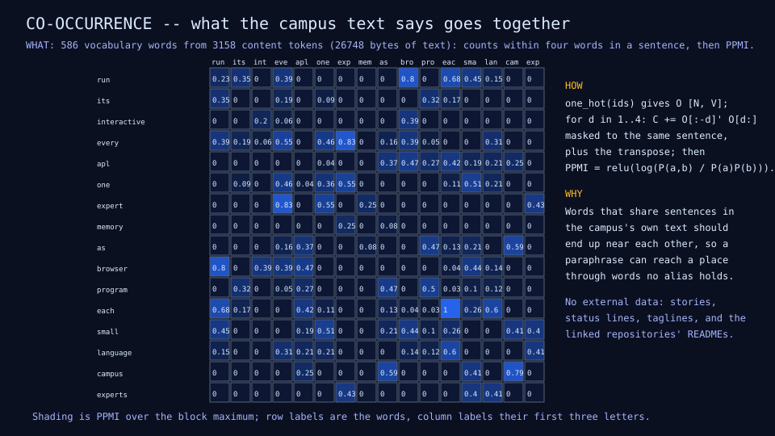
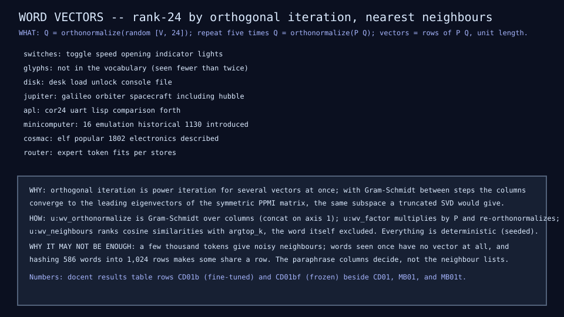
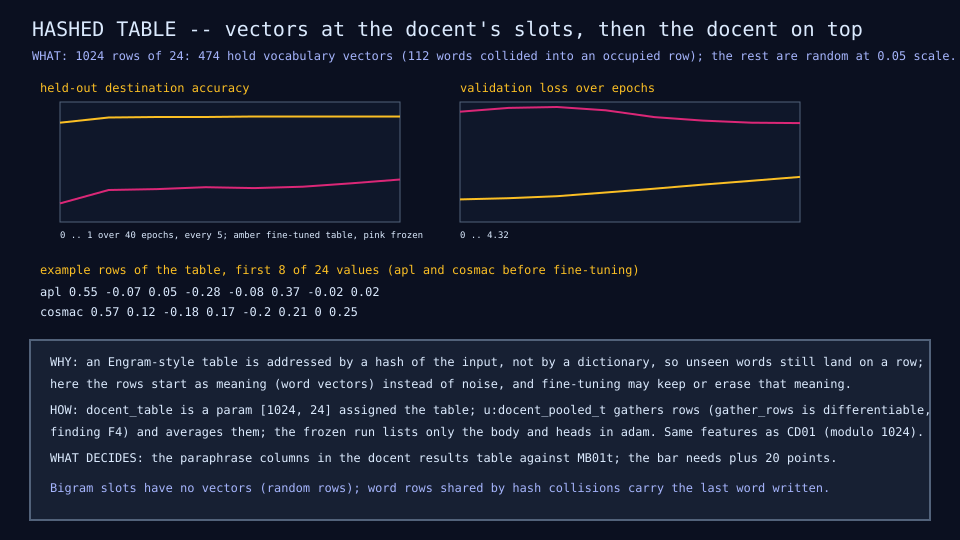

# CD01b: docent word vectors

## Question

Do word vectors trained on the campus's own text give the docent the
meaning its hashed features lack, enough to beat the deterministic matcher
on paraphrases?

## Change from the previous experiment

The same dense docent as CD01 with one change: the random embedding table
is replaced by an Engram-style hashed table whose rows start as word
vectors. The vectors are trained here, deterministically, from in-domain
text only (no external data): the snapshot's stories, status sentences,
titles and taglines, this repository's README, and the READMEs of the
repositories linked from snapshot A, assembled once by
`scripts/assemble-campus-docs` into `fixtures/campus/docs-a.txt`.

## Configuration

| Quantity | Value |
|---|---:|
| Text | 436 sentences, 4,390 words, 26,748 bytes |
| Vocabulary (seen twice or more, stop words dropped) | 586 words, 3,158 content tokens |
| Co-occurrence | window 4, within a sentence, symmetric |
| Association | positive pointwise mutual information (9,515 nonzero cells) |
| Factorization | rank 24, five orthogonal iterations with Gram-Schmidt |
| Table | 1,024 rows by 24, at the docent's hash slots; 474 rows filled, 112 words collided |
| Docent | as CD01: 1,024 slots, width 24, hidden 32, 40 epochs, learning rate 0.003 |
| Parameters | 26,003 (table 24,576) |

Two variants: fine-tuned (the table trains with the body and heads) and
frozen (only the body and heads train).

## Results

| Metric | CD01 random table | CD01b fine-tuned | CD01bf frozen | MB01t text matcher |
|---|---:|---:|---:|---:|
| Intent accuracy | 0.938 | 0.942 | 0.627 | 0.759 |
| Destination accuracy | 0.925 | 0.917 | 0.369 | 0.925 |
| Top-3 destination accuracy | 0.963 | 0.959 | 0.618 | 0.983 |
| Exhibit accuracy | 0.927 | 0.917 | 0.177 | 0.990 |
| Ambiguous rows, expected top-2 pair | 0.091 | 0.182 | 0.000 | 0.091 |
| Unsupported recall | 0.300 | 0.300 | 0.500 | 0.400 |
| Paraphrase destination accuracy | 0.296 | 0.407 | 0.259 | 0.685 |
| Paraphrase intent accuracy | 0.481 | 0.407 | 0.333 | 0.481 |
| Validation loss | 1.50 | 1.70 | 3.72 | - |

Margin on the paraphrase set against the stronger matcher: destination
minus 28 points (0.407 against 0.685); intent minus 7. The bar (plus 20 on
both, unsupported recall 0.8) is not met.







## What we learned

- Meaning helps, measurably: starting the table from in-domain vectors
  lifted paraphrase destination accuracy from 0.296 to 0.407 with the same
  model and data, and doubled the ambiguous top-2 hits (still low).
- Frozen vectors alone are far too weak (0.259 on paraphrases, 0.369 on
  templated rows): a few thousand words of text give noisy vectors, and
  words seen once have none. Fine-tuning recovers the templated accuracy
  and keeps some of the transfer.
- The matcher still wins on paraphrases because it reads the same words
  directly with hand-set weights; the docent has to learn that mapping from
  724 templated rows and does so only partly.
- Finding F21: a training loop wrapped in a user function reported good
  in-loop accuracy and chance-level accuracy afterwards; `adam` inside a
  user function trains local copies. Training now runs at top level, as in
  every earlier lesson.

## What we did not prove

That a tiny model can beat a good matcher at this data size. The next
candidates are more text (the campus is growing), a larger table with fewer
collisions, and the routed experts (CD02); the bar stays where it is.

## Raw evidence

```sh
just wordvec         # train the vectors and both docents (about three minutes) and check
just wordvec write   # regenerate the diagrams and the CD01b and CD01bf rows
just campus-docs     # reassemble docs-a.txt (network)
just tests tests/test_wordvec.mlpl
```

Code: [`lib/wordvec.mlpl`](../../lib/wordvec.mlpl), the table variants in
[`lib/docent.mlpl`](../../lib/docent.mlpl),
[`demos/docent_wordvec.mlpl`](../../demos/docent_wordvec.mlpl),
[`tests/test_wordvec.mlpl`](../../tests/test_wordvec.mlpl). Text:
[`fixtures/campus/docs-a.txt`](../../fixtures/campus/docs-a.txt). Rows
CD01b and CD01bf in the [docent results table](../reference/docent-results.md).
