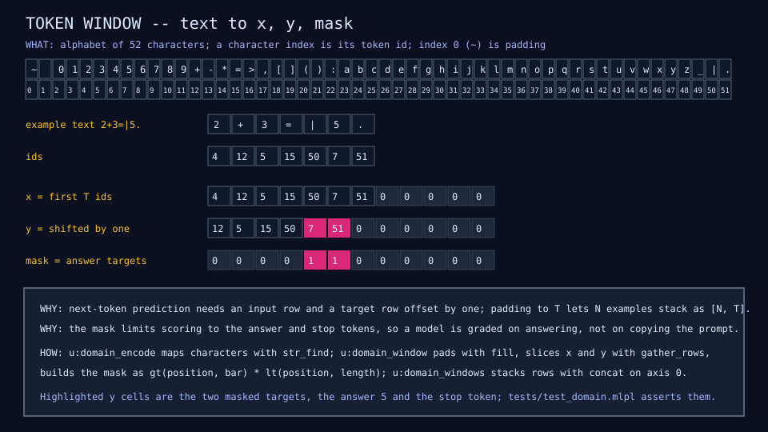
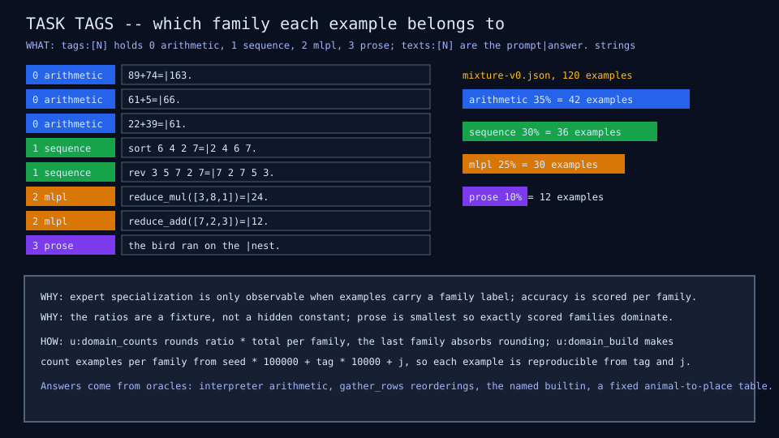
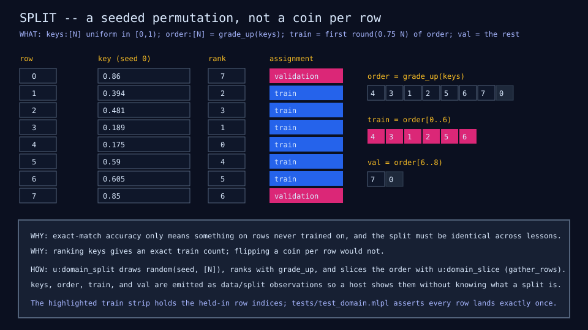

# DM01: synthetic domain

## Question

What does the model see, and is the held-out split honest?

## Change from the previous experiment

None: this is the fixture every later lesson consumes.

## Configuration

52-symbol alphabet (`~` pad and stop, digits, operators, brackets,
lowercase letters, `_`, `|`, `.`); four task families with oracles:
arithmetic, sequence, MLPL fragments, and prose (animal-to-place
patterns); a mixture of 120 examples at fixed ratios, window 28, seed 0,
split 0.75 by seeded key rank. Committed as
[`fixtures/domain/mixture-v0.json`](../../fixtures/domain/mixture-v0.json)
and reproduced inline for the server by `u:domain_mixture_v0`.

## Results

| Quantity | Value |
|---|---:|
| Examples, train / validation | 90 / 30 |
| Window (tokens) | 28 |
| Answer plus stop positions in the training split | 406 |
| Distinct 2-grams possible | 2,704 |

Every example is a padded x row, a shifted y row, and a mask that is one on
answer and stop positions only, so the loss never rewards copying the
prompt.







## What we learned

The families are separable by construction, which is what later makes
specialization (MX02) observable. The prose family is the only one whose
local pattern is learnable from 90 rows; that shapes every accuracy column
that follows.

## What we did not prove

Nothing about models. The domain is deliberately synthetic; conclusions
about ordinary text need a different fixture.

## Raw evidence

```sh
just domain          # run the demo and check the three diagrams are fresh
just domain write    # regenerate the committed diagrams from the demo
just tests           # native tests over generators, oracles, evaluation, results writer
```

Code: [`lib/domain.mlpl`](../../lib/domain.mlpl),
[`demos/domain_microscope.mlpl`](../../demos/domain_microscope.mlpl),
[`tests/test_domain.mlpl`](../../tests/test_domain.mlpl).
