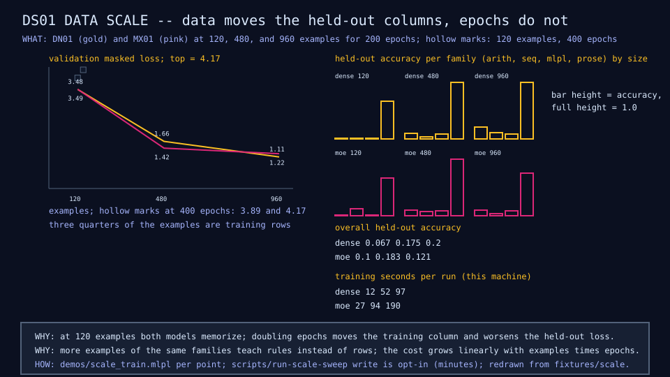

# DS01: data scale

## Question

Can longer training or more data fix the low-data behavior of DN01 and
MX01?

## Change from the previous experiment

The same two models trained at 120, 480, and 960 examples for 200 epochs,
and at 120 examples for 400 epochs.

## Configuration

Eight points, one seed each, fixed epoch budget; each point is a committed
fixture in `fixtures/scale/`, and the gate validates the points without
retraining. The full sweep takes about eight minutes.

## Results

| Examples, epochs | Dense val loss | Dense arith / seq / mlpl / prose | MoE val loss | MoE arith / seq / mlpl / prose | Source |
|---|---:|---|---:|---|---|
| 120, 200 | 3.48 | 0 / 0 / 0 / 0.667 | 3.49 | 0 / 0.111 / 0 / 0.667 | @120 rows |
| 120, 400 | 3.89 | 0 / 0 / 0 / 0.667 | 4.17 | 0 / 0 / 0 / 0.667 | @120 rows |
| 480, 200 | 1.66 | 0.088 / 0.030 / 0.077 / 1.0 | 1.42 | 0.088 / 0.061 / 0.077 / 1.0 | @480 rows |
| 960, 200 | 1.11 | 0.195 / 0.099 / 0.081 / 1.0 | 1.22 | 0.091 / 0.025 / 0.081 / 0.75 | @960 rows |

Training cost per point grows linearly with the example count; the
mixture costs about twice the dense time at every size.



## What we learned

Data is the lever and epochs are not
([finding 4](../results/current-findings.md)). The mixture wins at 480 and
loses at 960, so at this scale neither architecture dominates.

## What we did not prove

Where the curves go beyond 960 examples, or how much of the 480-versus-960
crossover is seed noise. DS02 in the distillation saga extends the sweep.

## Raw evidence

```sh
just scale           # validate the committed points and check the diagram (seconds)
just scale write     # rerun the whole sweep (about eight minutes) and reinstall
```

Code: [`lib/scale.mlpl`](../../lib/scale.mlpl),
[`demos/scale_train.mlpl`](../../demos/scale_train.mlpl),
[`demos/scale_microscope.mlpl`](../../demos/scale_microscope.mlpl). Points:
[`fixtures/scale/index-v1.json`](../../fixtures/scale/index-v1.json).
