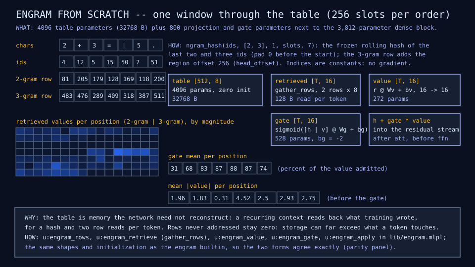
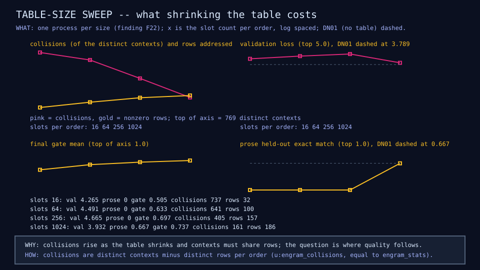
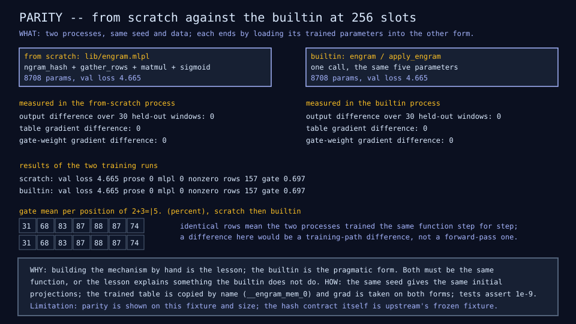

# EG01: Engram from scratch

## Question

Does external memory improve loss and tasks, and at what table size? And
is the mechanism written by hand the same function as the sw-MLPL
builtin?

## Change from the previous experiment

The DN01 block gains an Engram layer after attention. The last two and
three token ids are hashed (the frozen `ngram_hash` contract, pad 0
before the start) into one row each of a single table with two regions
(2-gram rows first, 3-gram rows offset by the slot count); the two rows
of 8 values are gathered and flattened into 16, projected to the hidden
width, and added to the hidden state through a sigmoid gate over the
concatenation of the hidden state and the value. The table starts at
zero and the gate bias at -2, so a fresh layer is an exact no-op. All of
it is written in `lib/engram.mlpl` from `ngram_hash`, `gather_rows`,
`matmul`, `concat`, and `sigmoid`; the builtin path is
`engram` / `apply_engram` / `engram_stats` over the same five parameters.

## Configuration

DN01's widths, data, epochs, and optimizer (16 wide, hidden 32, window
28, 120 examples with 90 training rows, 300 epochs at learning rate
0.003); orders 2 and 3, one head, 8 values per row, hash seed 7. Four
table sizes from scratch (1,024, 256, 64, and 16 slots per order) and the
builtin form at 256, each in its own process (finding F22); about four
minutes in all. The 256-slot from-scratch run is recorded over the live
server for the live demo.

Over the 90 training windows there are 257 distinct 2-gram contexts and
512 distinct 3-gram contexts (padding included).

## Results

| Slots per order | Table params | Table bytes (f64) | Rows addressed | Collisions (2-gram + 3-gram) | Final gate mean | Val loss | Prose held out | mlpl held out | Train exact match |
|---:|---:|---:|---:|---:|---:|---:|---:|---:|---:|
| DN01 (no table) | 0 | 0 | - | - | - | 3.79 | 0.667 | 0 | 0.70 |
| 1,024 | 16,384 | 131,072 | 186 of 2,048 | 24 + 137 | 0.737 | 3.93 | 0.667 | 0 | 0.77 |
| 256 | 4,096 | 32,768 | 157 of 512 | 106 + 299 | 0.697 | 4.67 | 0 | 0 | 0.80 |
| 64 | 1,024 | 8,192 | 100 of 128 | 193 + 448 | 0.633 | 4.49 | 0 | 0 | 0.86 |
| 16 | 256 | 2,048 | 32 of 32 | 241 + 496 | 0.505 | 4.27 | 0 | 0.286 | 0.80 |
| 256, builtin | 4,096 | 32,768 | 157 of 512 | 106 + 299 | 0.697 | 4.67 | 0 | 0 | 0.80 |

Rows EG01@1024, EG01@256, EG01@64, EG01@16, and EG01b@256 in the
[results table](../reference/results.md). Every table adds 800
projection and gate parameters and 816 active parameters per token (two
rows of 8 read, the projection, the gate).

Validation loss at the first checkpoint (epoch 25): DN01 1.94; Engram
2.66 (1,024), 2.48 (256), 2.30 (64), 2.31 (16). Training loss at the end:
DN01 0.19; Engram 0.12, 0.10, 0.08, 0.12.

Parity, measured in every process after copying the trained parameters
into the other form: output difference over the 30 held-out windows 0;
table gradient difference 0; gate-weight gradient difference 0. The
builtin run and the from-scratch run at 256 slots report the same loss
at every checkpoint, the same nonzero rows, and the same gate.







## What we learned

- The two forms are the same function: zero difference in outputs and
  gradients on trained parameters, in both directions, and identical
  training curves. The lesson's hand-written retrieval and gate explain
  exactly what `apply_engram` does.
- At 90 training windows, external memory is memorization capacity, and
  it hurts. Every table size lowers training loss below DN01's and raises
  validation loss above it (3.93 to 4.67 against 3.79); from the first
  checkpoint the Engram models are already behind (2.30 to 2.66 against
  1.94). The gate opens wide (0.5 to 0.74 from 0.12) and the model leans
  on rows that the held-out contexts do not share.
- The prediction that prose moves first did not hold: prose held-out
  accuracy stays at DN01's 0.667 only with the largest table and falls to
  zero below it. A held-out prose prompt shares its 2-gram contexts with
  training rows (`the cat sat on the`) but its addressed rows were
  trained on other targets, and the 3-gram contexts of the answer are
  new; smaller tables add collisions on top (405 of 769 contexts at 256
  slots, 737 at 16).
- Collisions and rows behave as designed: at 1,024 slots 161 of 769
  contexts collide and 186 rows are nonzero; at 16 slots every row is
  shared by many contexts. Only addressed rows ever move (the scatter-add
  backward), so a 131 KB table has 186 live rows after training.
- Findings on the way: a reshape with parameter-bound dims inside `grad`
  drops the gradient (F23, second form), and `apply_engram` with the ids
  bound to a function parameter does the same (F24); both pinned by
  probes and both fixed upstream on 2026-09-16. Upstream's F19 and F20 fixes landed during this step and their
  probes were flipped to expect the fixed behavior. Model ids count every model built, so the builtin's
  parameters are the `__engram_*_0` globals only when the engram is the
  first model created; the lesson creates it first.

## What we did not prove

That Engram helps at any data size: DS01 showed that 90 windows is where
architectural differences drown in memorization, and this lesson trained
at that size only. The candidates are the 480- and 960-example points
(DN01 and MX01 rows exist there), a smaller learning rate for the table,
and freezing the dense block (the upstream frozen-base recipe). The
recurrent Engram lesson (RE01) adds the ablation table; the table-size
question is answered only for this data.

## Raw evidence

```sh
just engram          # the five runs (about four minutes) and the diagram and row checks
just engram write    # regenerate the diagrams and the five rows
just recordings EG01 # the 256-slot run over the live server equals the pinned recording
just tests tests/test_engram.mlpl
scripts/run-probes   # includes the f23b and f24 reproducers
```

Code: [`lib/engram.mlpl`](../../lib/engram.mlpl),
[`demos/engram_microscope.mlpl`](../../demos/engram_microscope.mlpl),
[`demos/engram_diagrams.mlpl`](../../demos/engram_diagrams.mlpl),
[`tests/test_engram.mlpl`](../../tests/test_engram.mlpl). Recording:
[`fixtures/recordings/engram-run-v0.json`](../../fixtures/recordings/engram-run-v0.json),
replayed in the [live demo](https://sw-ml-study.github.io/moe-microscope/?lesson=eg01).
