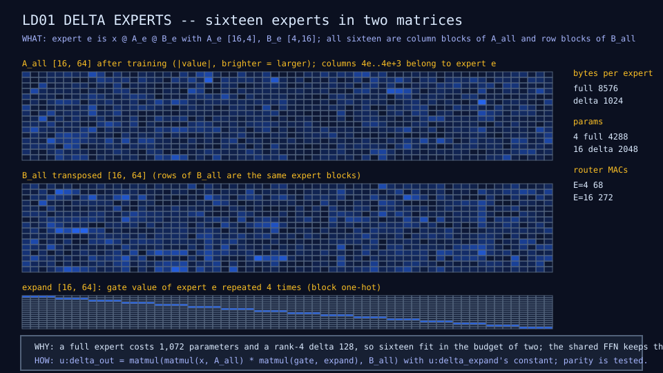
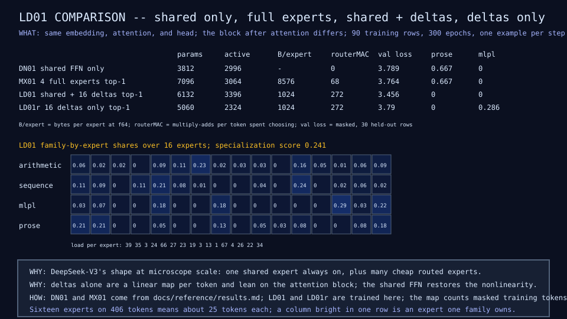

# LD01: low-rank delta experts

## Question

How many experts can we afford if each expert is a rank-4 delta rather
than a full feed-forward block?

## Change from the previous experiment

Experts become packed low-rank pairs (A_all [16, 64], B_all [64, 16]) with
a router over sixteen experts; one variant keeps a shared always-on FFN,
the other has deltas only. The routed sum is two matmuls with the gate
expanded by a constant block one-hot.

## Configuration

Same data, epochs, optimizer, and balance weight as MX01; E 16, rank 4,
k 1; router cost 272 multiply-adds per token. Both variants train in about
80 seconds.

## Results

| Configuration | Params | Active per token | Bytes per expert | Val loss | Training exact match | Source |
|---|---:|---:|---:|---:|---:|---|
| DN01 shared FFN only | 3,812 | 2,996 | - | 3.79 | 0.70 | DN01 row |
| MX01 four full experts | 7,096 | 3,064 | 8,576 | 3.76 | 0.62 | MX01 row |
| LD01 shared plus 16 deltas | 6,132 | 3,396 | 1,024 | 3.46 | 0.60 | LD01 row |
| LD01r 16 deltas only | 5,060 | 2,324 | 1,024 | 3.37 | 0.64 | LD01r row |

Sixteen deltas hold 2,048 parameters against 4,288 for four full experts.
Neither variant produced a held-out prose answer on this run; the LD01
specialization score over sixteen experts is 0.241.





## What we learned

Expert count is cheap when experts are deltas, and the cheap variants gave
the best validation losses in the table
([finding 6](../results/current-findings.md)).

## What we did not prove

That the loss advantage survives more data or seeds, or that the
deltas-only model (linear per token) keeps up once tasks need
nonlinearity. The configuration frontier saga owns those questions.

## Raw evidence

```sh
just delta           # train both variants (under a minute and a half) and check diagrams and rows
```

Code: `u:delta_expand`, `u:delta_out`, `u:delta_params`, `u:router_macs`
in [`lib/moe.mlpl`](../../lib/moe.mlpl);
[`demos/delta_experts.mlpl`](../../demos/delta_experts.mlpl).
