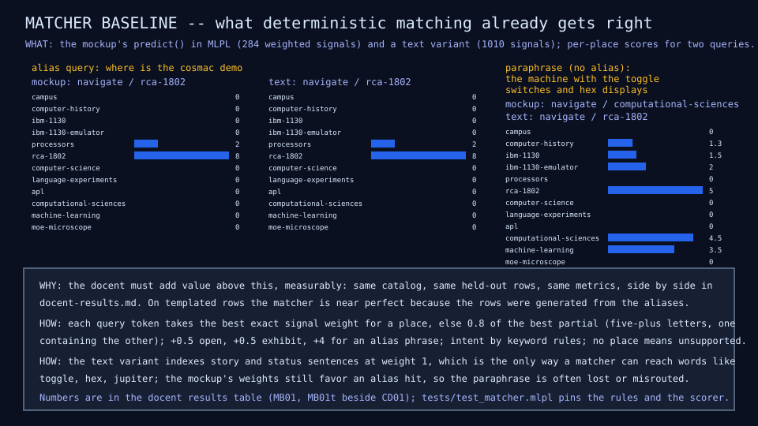

# MB01: the deterministic matcher baseline

## Question

What does deterministic matching over the same catalog already achieve on
the docent's held-out rows and paraphrases, and by how much must a trained
docent beat it to be worth shipping?

## Change from the previous experiment

No model. The campus mockup's `predict()` (alias-and-concept scoring with
keyword intent rules) is ported to MLPL and scored with exactly the metrics
CD01 reported, on exactly the same rows. A second variant indexes the
catalog's story and status sentences too, so the yardstick includes the
strongest matcher the same text allows.

## Configuration

| Matcher | Signals | What it reads |
|---|---:|---|
| MB01, the mockup's | 284 | titles (2), aliases (3), concepts (4), taglines (1.5); partial matches at 0.8; alias phrase bonus 4; open and exhibit bonuses 0.5 |
| MB01t, over all text | 1,010 | the same plus story and status sentences at weight 1 |

Intent by the mockup's keyword rules in their order (again, status, story,
here, navigate, recommend, explain, default navigate); a query that matches
no place is unsupported unless its intent is story or status, which the
mockup answers from the current place. One deviation from the mockup:
partial matches are checked as prefix or suffix containment, not any
substring; it changed no number in these fixtures.

## Results

Held-out rows: the 241 validation rows and the 54 paraphrases, as in CD01.

| Metric | CD01 dense docent | MB01 mockup matcher | MB01t text matcher |
|---|---:|---:|---:|
| Intent accuracy | 0.938 | 0.780 | 0.759 |
| Destination accuracy | 0.925 | 0.954 | 0.925 |
| Top-3 destination accuracy | 0.963 | 0.996 | 0.983 |
| Exhibit accuracy | 0.927 | 0.990 | 0.990 |
| Ambiguous rows, expected top-2 pair | 0.091 | 0.091 | 0.091 |
| Unsupported recall | 0.300 | 1.000 | 0.400 |
| Paraphrase destination accuracy | 0.296 | 0.630 | 0.685 |
| Paraphrase intent accuracy | 0.481 | 0.463 | 0.481 |
| Parameters | 26,003 | 0 | 0 |
| Interpreter time per query | 0.91 ms | about 80 ms | about 83 ms |

The usefulness-bar margin (docent minus the stronger matcher on the
paraphrase set): destination minus 39 points (0.296 against 0.685), intent
0 points (0.481 against 0.481). The bar requires plus 20 on both. Unsupported
recall 0.30 against the required 0.8.



## What we learned

- The trained docent does not add value today. A matcher with no
  parameters beats it on destinations, on paraphrases, and on rejecting
  off-topic questions; the docent wins only on intent, where keyword rules
  are crude.
- The matcher's paraphrase score comes from words the catalog already
  holds (concepts such as microprocessor, story words such as jupiter). The
  docent saw the same words in training rows but hashed features do not
  generalize from them. That is the gap word vectors (CD01b) exist to close.
- The matcher's interpreter time (about 80 ms per query) is the cost of
  string scanning in a loop-based port; the mockup's JavaScript runs the
  same algorithm in well under a millisecond. It is not a quality signal.
- The ambiguous rows are hard for everyone at 0.091: the expected top-2
  pairs are authored, not learned, and neither the rules nor the model
  rank them.

## What we did not prove

That any model can beat this yardstick. CD01b (word vectors from the
campus's own text into an Engram-style table) and CD02 (routed experts) are
measured against the MB01t column next; if the margin is not met, the
campus keeps its matcher, as the plan says.

## Raw evidence

```sh
just matcher         # score both matchers (about a minute) and check the diagram and rows
just matcher write   # regenerate them
just tests tests/test_matcher.mlpl
```

Code: [`lib/matcher.mlpl`](../../lib/matcher.mlpl),
[`demos/matcher_baseline.mlpl`](../../demos/matcher_baseline.mlpl),
[`tests/test_matcher.mlpl`](../../tests/test_matcher.mlpl). Rows MB01 and
MB01t in the [docent results table](../reference/docent-results.md). The
mockup's algorithm: `pages/index.html` in the sw-campus repository
(read only from here).
