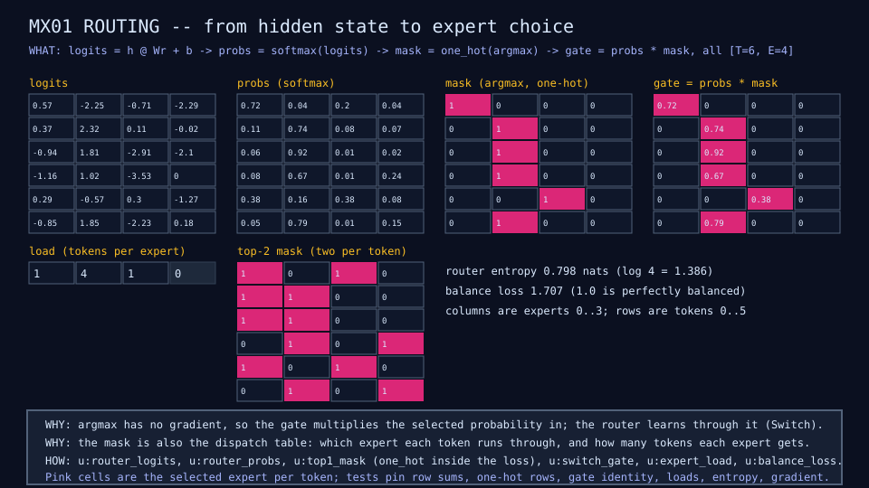

<!-- Moved verbatim from README.md in Saga 3 step 4; rewritten as a laboratory report in step 5. -->

# Routing microscope

MX01 begins with the router alone, before any training: six tokens' hidden
states become logits, softmax probabilities, a one-hot expert choice, and a
Switch-style gate that keeps only the chosen expert's probability so the
router still receives a gradient. The mask doubles as the dispatch table, and
the same diagram shows per-expert load, router entropy, the load-balance
term, and the top-2 mask that MX02 will use.



```sh
just router          # run the routing microscope and check its diagram
just tests tests/test_moe.mlpl
```
