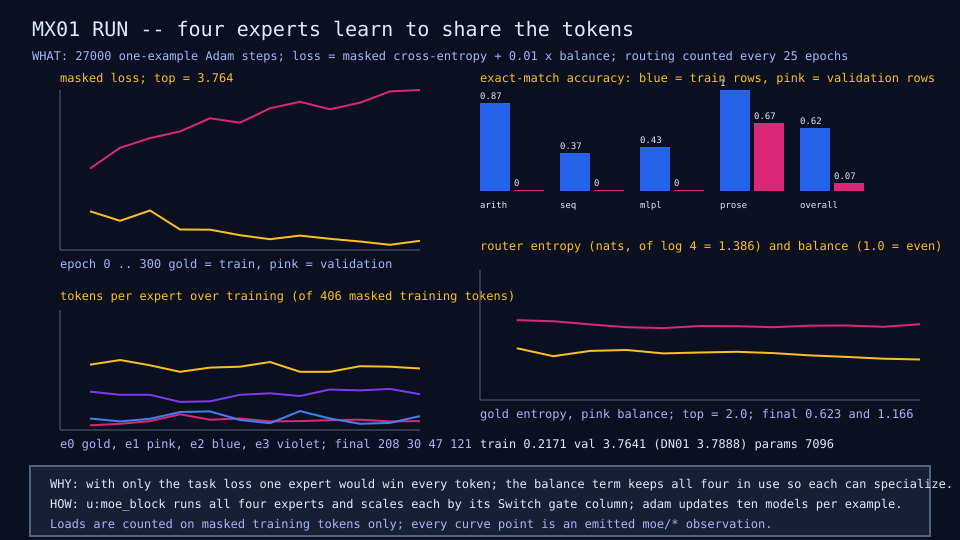
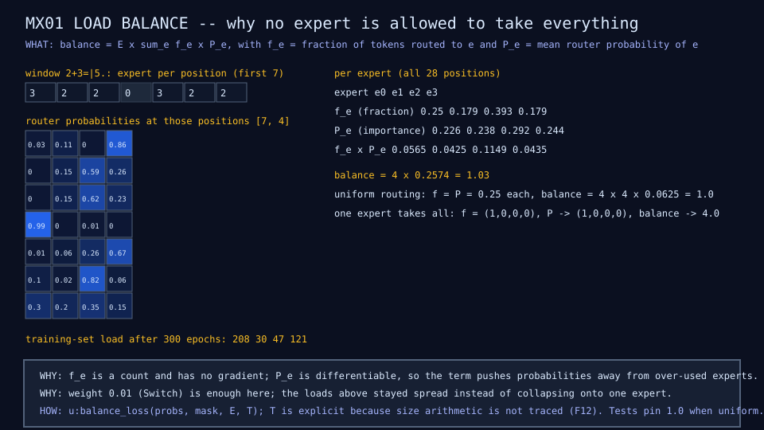

# MX01: top-1 mixture, trained

## Question

Can the model store more capacity than it executes per token without
losing quality?

## Change from the previous experiment

The single feed-forward block of DN01 becomes four experts behind a top-1
router with a load-balance term (weight 0.01). Training is dense-masked:
every expert runs and the gate zeros the unchosen ones.

## Configuration

Same widths, data, epochs, and optimizer as DN01; E 4, k 1, alpha 0.01.
About 36 seconds.

## Results

| Metric | DN01 | MX01 | Source |
|---|---:|---:|---|
| Parameters | 3,812 | 7,096 | rows |
| Active parameters per token | 2,996 | 3,064 | rows |
| Validation loss | 3.79 | 3.76 | rows |
| Held-out exact match: prose | 0.667 | 0.667 | rows |
| Training exact match | 0.70 | 0.62 | run diagrams |
| Router entropy | - | 0.623 | MX01 row |
| Balance term | - | 1.166 | MX01 row |
| Tokens per expert at the end | - | 208, 30, 47, 121 | moe-run diagram |





## What we learned

Stored capacity grew 1.86 times for 1.02 times the active parameters at
the same validation loss ([finding 1](../results/current-findings.md)).
Balance weight 0.01 kept all four experts in use without flattening the
router.

## What we did not prove

A quality win. Training exact match is lower than dense; the mixture only
starts to lead at 480 examples (DS01).

## Raw evidence

```sh
just moe             # run MX01 and check its diagrams and results row
just moe write       # regenerate the committed diagrams and the MX01 results row
```

Code: [`demos/moe_baseline.mlpl`](../../demos/moe_baseline.mlpl). Exports
[`fixtures/moe/mx01-family-by-expert.json`](../../fixtures/moe/mx01-family-by-expert.json)
and the recording
[`fixtures/recordings/moe-top1-run-v0.json`](../../fixtures/recordings/moe-top1-run-v0.json).
