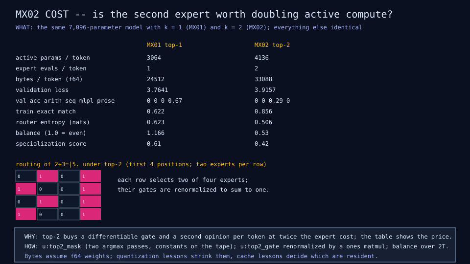

# MX02: top-2 routing and the specialization map

## Question

What does the second expert buy, and do experts specialize by task family
without being told the family?

## Change from the previous experiment

Top-2 routing with gates renormalized over the two kept experts; a
measured family-by-expert map for MX01 and MX02 side by side.

## Configuration

Same as MX01 with k 2. The specialization score is the mean over families
of the largest expert share (0.25 when routing ignores the family).

## Results

| Metric | MX01 top-1 | MX02 top-2 | Source |
|---|---:|---:|---|
| Active parameters per token | 3,064 | 4,136 | rows |
| Expert evaluations per token | 1 | 2 | rows |
| Bytes per token | 24,512 | 33,088 | rows |
| Validation loss | 3.76 | 3.92 | rows |
| Training exact match | 0.62 | 0.86 | moe2-cost diagram |
| Held-out MLPL exact match | 0 | 0.286 | rows |
| Held-out prose exact match | 0.667 | 0 | rows |
| Router entropy | 0.623 | 0.506 | rows |
| Specialization score | 0.61 | 0.42 | moe2-specialization diagram |

Under top-1, prose puts 87 percent of its tokens on one expert and
arithmetic 53 percent on another.




## What we learned

Experts specialize under top-1 with no family label
([finding 2](../results/current-findings.md)). Top-2 fits better,
generalizes differently, costs twice the expert work, and flattens the map
([finding 3](../results/current-findings.md)).

## What we did not prove

That specialization emerges on ordinary text: the families are separable
by construction. Nor which k is right in general: one data size, one seed.

## Raw evidence

```sh
just moe2            # run MX02 and check its diagrams and results row
```

Code: `u:top2_gate`, `u:specialization_score` in
[`lib/moe.mlpl`](../../lib/moe.mlpl);
[`demos/moe_top2.mlpl`](../../demos/moe_top2.mlpl). Recording:
[`fixtures/recordings/moe-top2-run-v0.json`](../../fixtures/recordings/moe-top2-run-v0.json).
