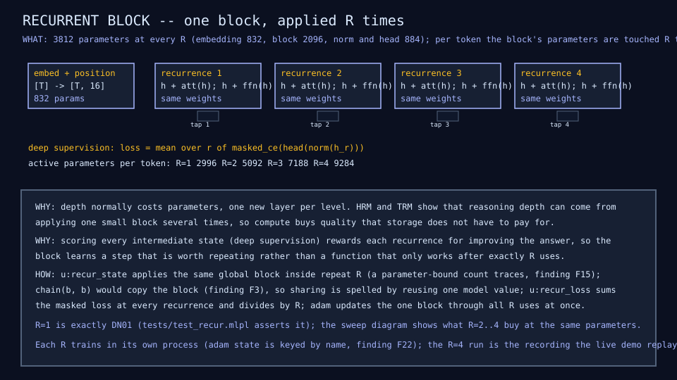
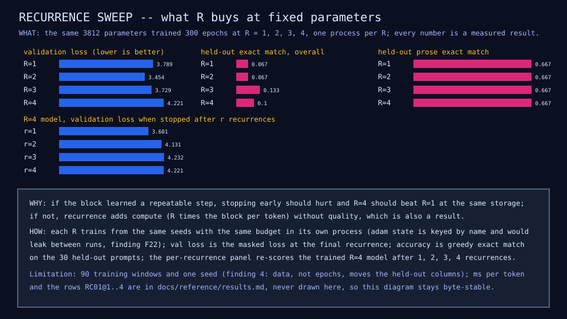
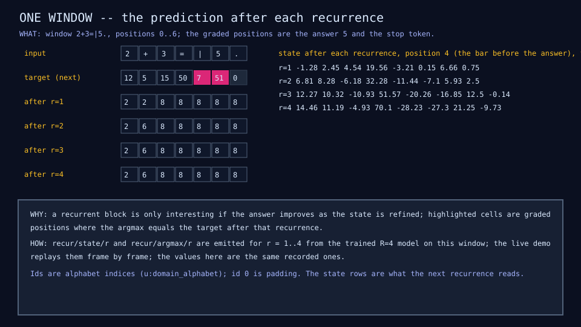

# RC01: recurrent block

## Question

Does applying one block several times, with every recurrence scored,
replace parameters? At fixed storage, what do R = 2, 3, 4 buy over R = 1?

## Change from the previous experiment

The DN01 block (attention with a residual, feed-forward with a residual,
RMS norm, head) is applied R times to the same token state instead of
once. Nothing is added: the same 3,812 parameters at every R. Training uses
deep supervision: the head is scored after every recurrence and the masked
losses are averaged, so each recurrence is rewarded for improving the
answer. R = 1 is DN01 exactly (asserted in the tests and visible in the
identical validation loss).

## Configuration

Widths 16 and 32, one head, window 28; 120 examples (90 training, 30 held
out); 300 epochs at learning rate 0.003, one Adam step per window; seeds as
DN01. Four models, one per R, each trained in its own process (about two
and a half minutes in all): Adam keeps per-parameter state by name and it
survives re-creating a model under the same name (finding F22), so a sweep
in one process contaminates every run after the first. The R = 4 run is
also recorded frame by frame over the live server for the live demo.

## Results

| R | Params | Active per token | Val loss | Perplexity | Held-out arith / seq / mlpl / prose | Overall | Train exact match | ms per token |
|---:|---:|---:|---:|---:|---|---:|---:|---:|
| 1 | 3,812 | 2,996 | 3.79 | 44.2 | 0 / 0 / 0 / 0.667 | 0.067 | 0.70 | 0.020 |
| 2 | 3,812 | 5,092 | 3.45 | 31.6 | 0 / 0 / 0 / 0.667 | 0.067 | 0.76 | 0.037 |
| 3 | 3,812 | 7,188 | 3.73 | 41.6 | 0 / 0 / 0.286 / 0.667 | 0.13 | 0.74 | 0.054 |
| 4 | 3,812 | 9,284 | 4.22 | 68.1 | 0 / 0 / 0.143 / 0.667 | 0.10 | 0.82 | 0.071 |

Rows RC01@1 to RC01@4 in the [results table](../reference/results.md).

Each trained model, stopped after r recurrences, on the held-out rows:

| Trained at | stop 1 | stop 2 | stop 3 | stop 4 |
|---|---:|---:|---:|---:|
| R = 1 | 3.79 | 4.38 | 4.89 | 5.07 |
| R = 2 | 3.29 | 3.45 | 3.46 | 3.68 |
| R = 3 | 3.45 | 3.73 | 3.73 | 3.72 |
| R = 4 | 3.60 | 4.13 | 4.23 | 4.22 |







## What we learned

- At fixed parameters, R = 2 with deep supervision reaches validation loss
  3.45 against 3.79 for the same block applied once: repeated compute
  bought some quality that storage did not pay for. R = 3 gives the first
  held-out MLPL answers of any dense model here (0.286). R = 4 is worse than
  R = 1 (4.22).
- The gain is not refinement. Every model scores best when stopped after
  its first recurrence (3.29 for the R = 2 model, better than anything in
  the table before this lesson), and later recurrences make its held-out
  loss worse. Deep supervision trained a block whose single application
  generalizes better; the recurrences it was trained with are not a
  reasoning loop that converges. Training exact match rises with R (0.70 to
  0.82) while held-out loss does not, the usual memorization pattern.
- Cost is linear: R times the block work per token, 3.5 times at R = 4.
- Finding F22, met while measuring this: Adam's state is keyed by name and
  outlives a re-created model, so the first sweep (one process) reported
  R = 4 at 2.88; the isolated run gives 4.22, which the live-server
  recording confirmed. Two earlier lessons that trained two variants in one
  process are re-measured in the next step.

## What we did not prove

That the R = 2 improvement survives more data or seeds, or that the block
"reasons" over recurrences (the stop-early rows say it does not). One seed
per point, 90 training windows (finding 4: data moves these columns most),
and a non-monotonic curve: a sweep with more seeds is needed before the
recurrent block is called a win.

## Raw evidence

```sh
just recur           # train the four models (minutes) and check diagrams and rows
just recur write     # regenerate them
just recordings RC01 # the R=4 run over the live server equals the pinned recording
just tests tests/test_recur.mlpl
```

Code: [`lib/recur.mlpl`](../../lib/recur.mlpl),
[`demos/recurrent_block.mlpl`](../../demos/recurrent_block.mlpl),
[`tests/test_recur.mlpl`](../../tests/test_recur.mlpl). Recording:
[`fixtures/recordings/recurrent-block-run-v0.json`](../../fixtures/recordings/recurrent-block-run-v0.json),
replayed in the [live demo](https://sw-ml-study.github.io/moe-microscope/?lesson=rc01).
