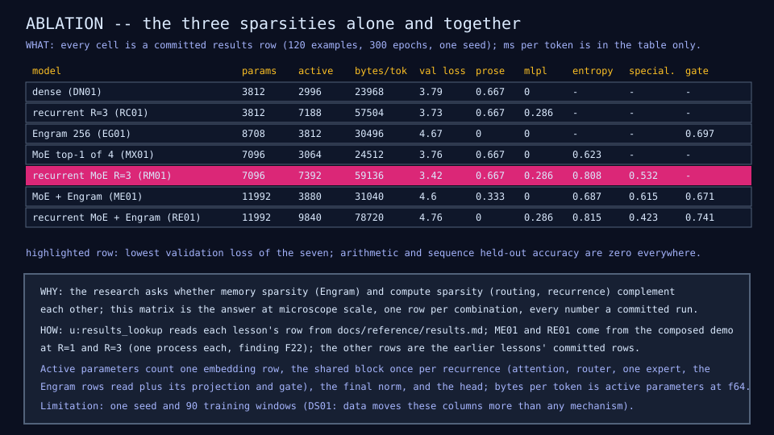
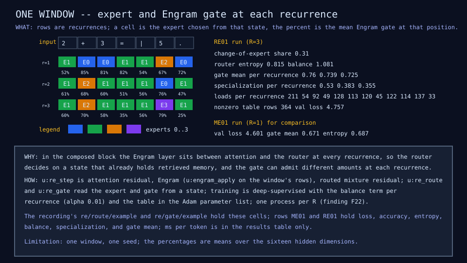

# RE01: recurrent mixture plus Engram

## Question

Do memory sparsity and compute sparsity complement each other? All three
sparsities in one model: parameter sparsity (one block reused R times),
compute sparsity (one of four experts per token), and memory sparsity (a
hashed table read by the last two and three tokens).

## Change from the previous experiment

The RM01 block gains EG01's Engram layer between attention and the router:
one recurrence is attention with a residual, the Engram layer (256 slots
per order, 8 values per row, the from-scratch form), then the routed
mixture with a residual. The router therefore decides on a state that
already holds retrieved memory, and the gate can admit a different amount
at each recurrence. Deep supervision and the per-recurrence balance term
are as in RM01; the table trains in the same Adam list as the block. R = 1
gives the mixture-plus-Engram row (ME01) and R = 3 the composed row (RE01),
one process each.

## Configuration

Widths 16 and 32, one head, window 28; 120 examples (90 training, 30 held
out); 300 epochs at learning rate 0.003, balance weight 0.01; seeds as
MX01 and EG01. 11,992 parameters at every R (the MX01 mixture's 7,096 plus
a 512-row table of 8 and 800 projection and gate parameters); active per
token 3,880 at R = 1 and 9,840 at R = 3. About six minutes for both
processes; the R = 3 run is recorded over the live server for the live
demo.

## Results

The ablation matrix (every cell a committed results row; arithmetic and
sequence held-out accuracy are zero in every row):

| Model | Params | Active per token | Val loss | Prose | MLPL | Train exact match | Entropy | Specialization | Engram gate |
|---|---:|---:|---:|---:|---:|---:|---:|---:|---:|
| Dense (DN01) | 3,812 | 2,996 | 3.79 | 0.667 | 0 | 0.70 | - | - | - |
| Recurrent R=3 (RC01) | 3,812 | 7,188 | 3.73 | 0.667 | 0.286 | 0.74 | - | - | - |
| Engram 256 (EG01) | 8,708 | 3,812 | 4.67 | 0 | 0 | 0.80 | - | - | 0.697 |
| MoE top-1 of 4 (MX01) | 7,096 | 3,064 | 3.76 | 0.667 | 0 | 0.62 | 0.623 | - | - |
| Recurrent MoE R=3 (RM01) | 7,096 | 7,392 | 3.42 | 0.667 | 0.286 | 0.43 | 0.808 | 0.532 | - |
| MoE + Engram (ME01) | 11,992 | 3,880 | 4.60 | 0.333 | 0 | 0.79 | 0.687 | 0.615 | 0.671 |
| Recurrent MoE + Engram (RE01) | 11,992 | 9,840 | 4.76 | 0 | 0.286 | 0.99 | 0.815 | 0.423 | 0.741 |

Rows ME01 and RE01 in the [results table](../reference/results.md); the
other rows are the earlier lessons'. Validation loss at the first
checkpoint (epoch 25): ME01 2.44, RE01 2.20 (DN01 1.94, RM01 at R = 3 also
falls later). Training loss at the end: ME01 0.096, RE01 0.006.

RE01 routing and memory: change-of-expert share 0.31; loads per
recurrence 211/54/92/49, 128/113/120/45, 122/114/137/33; specialization
0.53, 0.38, 0.36; gate mean per recurrence 0.760, 0.739, 0.725; 364 of
512 table rows nonzero (every addressed row). ME01: loads 191/62/42/111,
specialization 0.615, gate mean 0.671.





## What we learned

- They do not complement each other at this data size; they compound
  memorization. Adding the table to the mixture (ME01) takes validation
  loss from 3.76 to 4.60, and adding recurrence on top (RE01) to 4.76 with
  training loss 0.006 and training exact match 0.99: the composed model
  fits the 90 windows almost perfectly and generalizes worst of the seven.
  Each mechanism alone was neutral (MoE) or helpful (recurrence, 3.42 with
  routing); the table is what turns the extra capacity into memorization
  (finding 10), and recurrence gives it more compute to do so with.
- The mechanisms still behave as designed inside the composition: the
  router re-decides at every recurrence (31 percent of tokens change
  expert), loads stay spread with the balance term, and the gate opens
  wide at every recurrence (0.72 to 0.76) rather than closing on the
  memorized rows.
- Specialization falls with the table in the loop (0.53, 0.38, 0.36
  against RM01's 0.65, 0.45, 0.49): with retrieved memory in the state,
  the family is a weaker signal for the router.
- Cost is additive: RE01 touches 9,840 parameters per token for the
  lowest training loss and the highest validation loss in the matrix.

## What we did not prove

That the composition would not help with more data. DS01 showed that at
90 windows every model memorizes and that data moves the columns more
than any mechanism (dense validation loss 3.48 to 1.11 from 120 to 960
examples); the Engram rows in this matrix are the ones that most need the
480- and 960-example points, and a frozen-block or lower-table-learning-
rate variant. One seed per row.

## Raw evidence

```sh
just re              # both processes (about six minutes) and the diagram and row checks
just re write        # regenerate the diagrams and the ME01 and RE01 rows
just recordings RE01 # the R=3 run over the live server equals the pinned recording
just tests tests/test_re.mlpl
```

Code: [`lib/recur.mlpl`](../../lib/recur.mlpl) (the `u:re_*` functions),
[`lib/engram.mlpl`](../../lib/engram.mlpl),
[`demos/recurrent_moe_engram.mlpl`](../../demos/recurrent_moe_engram.mlpl),
[`demos/recurrent_moe_engram_diagrams.mlpl`](../../demos/recurrent_moe_engram_diagrams.mlpl),
[`tests/test_re.mlpl`](../../tests/test_re.mlpl). Recording:
[`fixtures/recordings/recurrent-moe-engram-run-v0.json`](../../fixtures/recordings/recurrent-moe-engram-run-v0.json),
replayed in the [live demo](https://sw-ml-study.github.io/moe-microscope/?lesson=re01).
