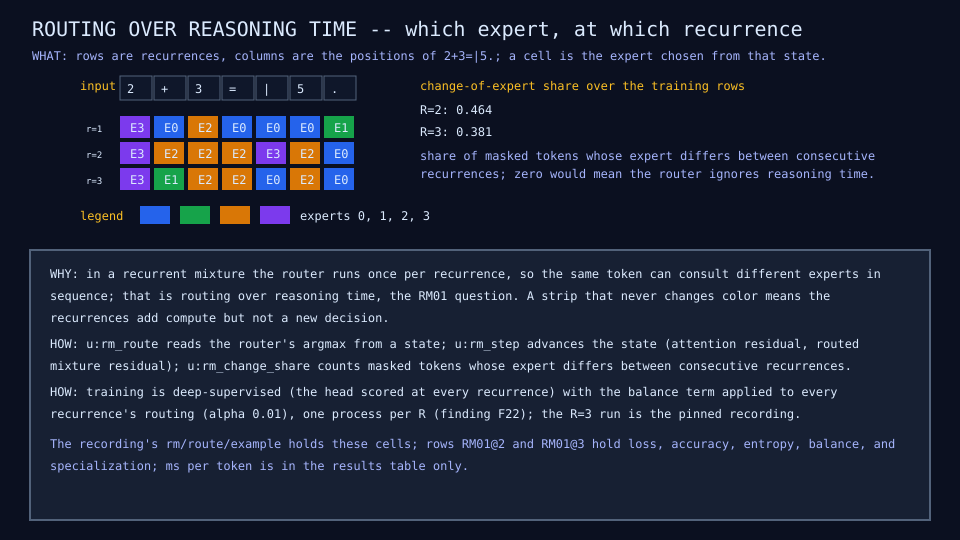
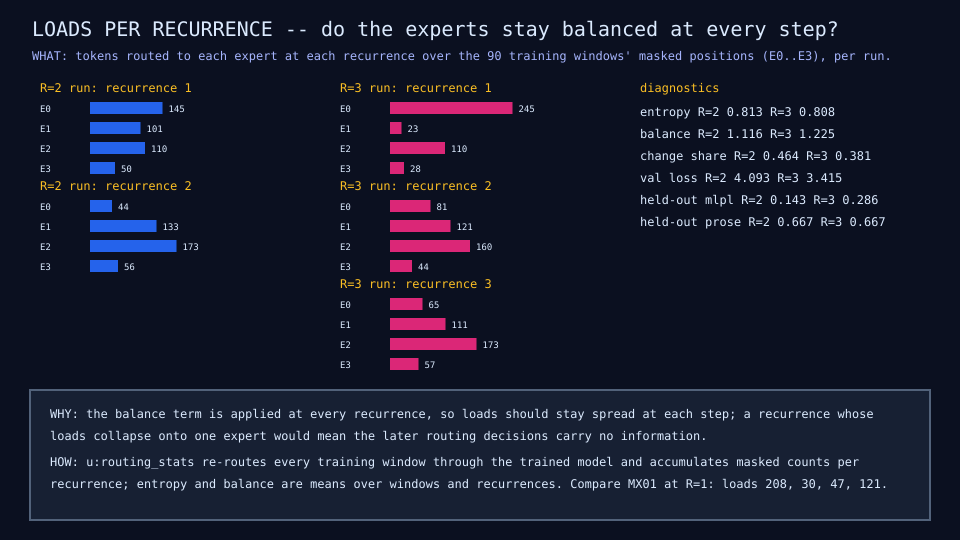
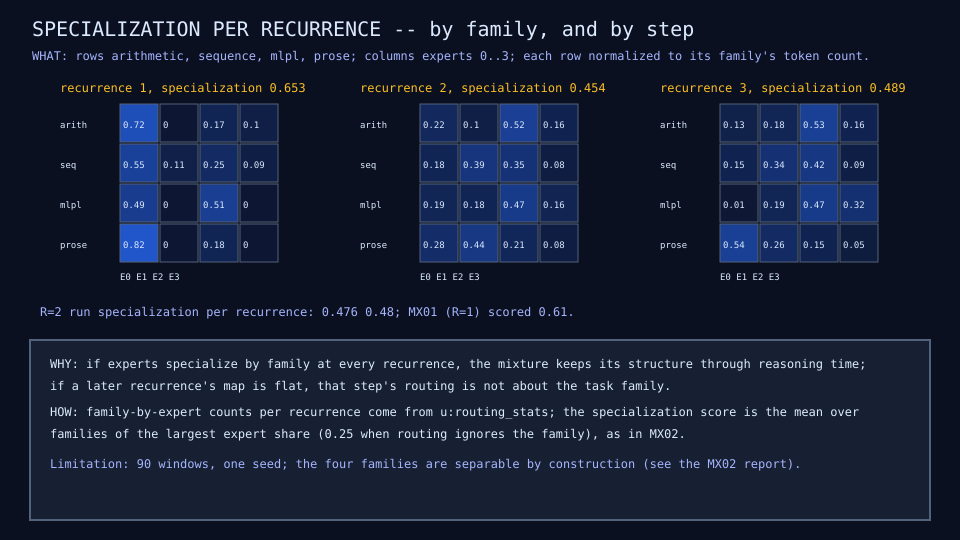

# RM01: recurrent mixture

## Question

When the mixture block is applied R times and the router runs at every
recurrence, does expert selection change over reasoning time, and do the
experts specialize by recurrence as well as by task family?

## Change from the previous experiment

The block that RC01 reuses is now the MX01 block: attention with a
residual, then four routed experts behind a top-1 router with the balance
term, with a residual. The block is applied R times to the same token
state, so the router decides once per recurrence and a token can consult
different experts in sequence. Training is deep-supervised as in RC01 (the
head is scored after every recurrence) and the balance term is applied to
every recurrence's routing (weight 0.01). Nothing else changes: the same
7,096 parameters as MX01 at every R.

## Configuration

Widths 16 and 32, one head, window 28; 120 examples (90 training, 30 held
out); 300 epochs at learning rate 0.003, one Adam step per window; seeds
as MX01. Two models, R = 2 and R = 3, each in its own process (finding
F22); about four minutes in all. The R = 3 run is also recorded over the
live server for the live demo.

## Results

| Metric | MX01 (R = 1) | RM01 R = 2 | RM01 R = 3 | RC01 R = 2 (dense) | RC01 R = 3 (dense) |
|---|---:|---:|---:|---:|---:|
| Parameters | 7,096 | 7,096 | 7,096 | 3,812 | 3,812 |
| Active per token | 3,064 | 5,228 | 7,392 | 5,092 | 7,188 |
| Validation loss | 3.76 | 4.09 | 3.42 | 3.45 | 3.73 |
| Perplexity | 43.1 | 59.9 | 30.4 | 31.6 | 41.6 |
| Held-out mlpl / prose | 0 / 0.667 | 0.143 / 0.667 | 0.286 / 0.667 | 0 / 0.667 | 0.286 / 0.667 |
| Training exact match | 0.62 | 0.70 | 0.43 | 0.76 | 0.74 |
| Router entropy | 0.623 | 0.813 | 0.808 | - | - |
| Balance term | 1.166 | 1.116 | 1.225 | - | - |
| Change-of-expert share | - | 0.464 | 0.381 | - | - |
| Specialization per recurrence | 0.61 | 0.48, 0.48 | 0.65, 0.45, 0.49 | - | - |
| ms per token | 0.046 | 0.082 | 0.122 | 0.037 | 0.054 |

Rows RM01@2 and RM01@3 in the [results table](../reference/results.md).

Tokens per expert (experts 0 to 3) at each recurrence, over the masked
positions of the 90 training windows:

| Run | Recurrence 1 | Recurrence 2 | Recurrence 3 |
|---|---|---|---|
| R = 2 | 145, 101, 110, 50 | 44, 133, 173, 56 | - |
| R = 3 | 245, 23, 110, 28 | 81, 121, 160, 44 | 65, 111, 173, 57 |
| MX01 | 208, 30, 47, 121 | - | - |







## What we learned

- Routing does change over reasoning time: 46 percent of masked tokens
  (R = 2) and 38 percent (R = 3) switch expert between consecutive
  recurrences, and the loads move with them (expert 0 takes 245 tokens at
  the first recurrence of the R = 3 model and 65 at the third). The
  recurrences are new routing decisions, not repeated ones.
- The R = 3 mixture reaches validation loss 3.42, the lowest of any model
  trained on 120 examples in the results table (the dense recurrent block
  at R = 2 had 3.45, MX01 3.76), and matches RC01's first held-out MLPL
  answers (0.286). Its training exact match is the lowest (0.43), so this
  is not memorization. R = 2 is worse than MX01 (4.09); one seed, so the
  ordering across R is not established.
- Specialization is strongest at the first recurrence (0.65 against 0.61
  for MX01) and weaker later (0.45, 0.49): the first routing decision is
  about the task family, the later ones less so. The balance term applied
  per recurrence kept every expert in use at every step (entropy 0.81
  against MX01's 0.62).
- Finding F23, met on the way: a reshape whose row count is derived from
  `shape()` inside `grad` drops the gradient through the reshaped value
  without an error. Written that way, the gate had no gradient and the
  R = 2 run collapsed onto expert 0 (loads 406, 0, 0, 0; change share 0;
  every accuracy 0). Literal window lengths, and prompts padded to them,
  restore the numbers above. Pinned by a probe.

## What we did not prove

That the R = 3 result survives more seeds or more data: one seed per
point, 90 training windows, and a non-monotonic curve (R = 2 below the
baseline, R = 3 above it). Whether the later recurrences refine the
answer or only regularize the block (RC01's stop-early rows said the
latter for the dense block) is not measured here; the recurrent Engram
lesson (RE01) adds the ablation table.

## Raw evidence

```sh
just rm              # train both models (about four minutes) and check diagrams and rows
just rm write        # regenerate them
just recordings RM01 # the R=3 run over the live server equals the pinned recording
just tests tests/test_recur.mlpl
scripts/run-probes   # includes the F23 reproducer
```

Code: [`lib/recur.mlpl`](../../lib/recur.mlpl),
[`demos/recurrent_moe.mlpl`](../../demos/recurrent_moe.mlpl),
[`demos/recurrent_moe_diagrams.mlpl`](../../demos/recurrent_moe_diagrams.mlpl),
[`tests/test_recur.mlpl`](../../tests/test_recur.mlpl),
[`probes/f23_shape_derived_reshape_in_grad.mlpl`](../../probes/f23_shape_derived_reshape_in_grad.mlpl).
Recording:
[`fixtures/recordings/recurrent-moe-run-v0.json`](../../fixtures/recordings/recurrent-moe-run-v0.json),
replayed in the [live demo](https://sw-ml-study.github.io/moe-microscope/?lesson=rm01).
