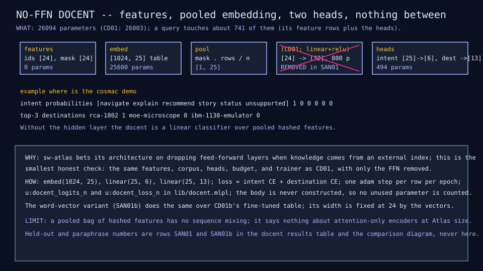
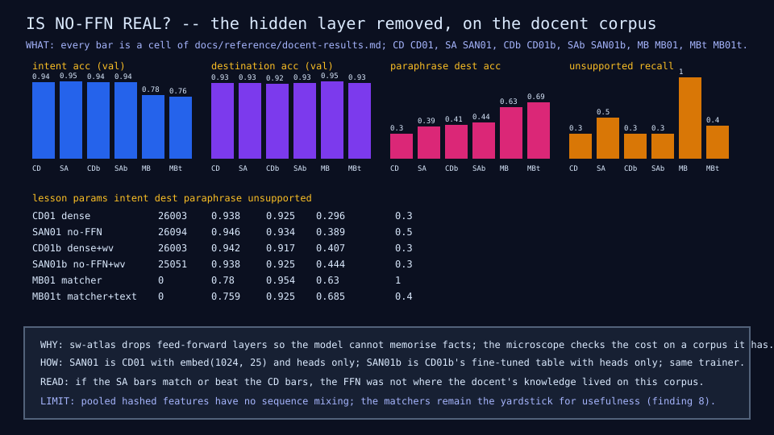

# SAN01: is no-FFN real? The docent without its feed-forward layer

## Question

Does the campus docent lose anything when its one hidden layer is removed
at matched budget? sw-atlas bets its architecture on dropping feed-forward
layers so the model cannot memorise facts it was not shown, and asked the
microscope to check the cost on a corpus it already has before Atlas's
Saga 5.

## Change from the previous experiment

CD01 and CD01b with the hidden layer removed: the intent and destination
heads read the pooled embedding directly, so the model is a linear
classifier over pooled features. SAN01 keeps CD01's hashed features and
widens the embedding from 24 to 25 so the parameter count matches (26,094
against 26,003); the body is never constructed, so no unused parameter is
counted. SAN01b keeps CD01b's fine-tuned word-vector table, whose width
is fixed at 24 by the vectors, and reports the smaller count (25,051).
Same corpus, split, trainer (one Adam step per row per epoch), and 40
epochs; one process per variant.

## Configuration

| Quantity | SAN01 | SAN01b |
|---|---:|---:|
| Features | hashed words and bigrams, 1,024 slots, 24 per query | the same, addressing a word-vector table |
| Embedding | 1,024 by 25, learned | 1,024 by 24 from PPMI rank-24 vectors, fine-tuned |
| Hidden layer | none | none |
| Heads | intent 25 to 6, destination 25 to 13 | 24 to 6, 24 to 13 |
| Parameters | 26,094 | 25,051 |
| Active parameters per query (mean 9.9 features) | 741 | 712 |
| Training time (interpreter) | about a minute | about two minutes |

## Results

Held-out rows are the 241 validation rows and the 54 paraphrases (no
alias verbatim, never trained on). Dense twins from the CD01 and CD01b rows.

| Metric | CD01 | SAN01 | CD01b | SAN01b |
|---|---:|---:|---:|---:|
| Validation loss | 1.50 | 1.19 | 1.70 | 1.17 |
| Intent accuracy | 0.938 | 0.946 | 0.942 | 0.938 |
| Destination accuracy | 0.925 | 0.934 | 0.917 | 0.925 |
| Top-3 destination accuracy | 0.963 | 0.971 | 0.959 | 0.967 |
| Exhibit accuracy | 0.927 | 0.938 | 0.917 | 0.927 |
| Ambiguous rows with the expected top-2 set | 0.091 | 0.273 | 0.182 | 0.545 |
| Unsupported recall | 0.3 | 0.5 | 0.3 | 0.3 |
| Paraphrase destination accuracy | 0.296 | 0.389 | 0.407 | 0.444 |
| Paraphrase intent accuracy | 0.481 | 0.481 | 0.407 | 0.463 |
| Training exact match (intent, destination) | 1, 1 | 1, 1 | 1, 1 | 1, 1 |





## What we learned

No-FFN does not lose on this corpus. Both variants match or beat their
dense twins on every held-out column, with lower validation loss and
better rejection of off-topic questions in the hashed case. The hidden
layer was not where the docent's knowledge lived: a pooled bag of hashed
features with two linear heads is already the classifier the 724 training
rows support, and the nonlinearity gave the model parameters to memorise
with and nothing to generalise with. This is
[finding 12](../results/current-findings.md).

For Atlas that is the answer it asked for: at this size, on a corpus
whose knowledge sits outside the weights (the catalog supplies every
title, URL, and story), removing the FFN costs nothing measurable.

## What we did not prove

That attention-only encoders keep this property at Atlas's size: the
docent has no sequence mixing at all, so the FFN here sat between a
pooled mean and linear heads, not between attention layers. One seed, one
corpus, one split. And the deterministic matchers still beat every docent
on paraphrases (0.63 to 0.685 against 0.389 to 0.444), so the usefulness
bar of Saga 4 is unchanged: no-FFN removes a cost, it does not add the
missing meaning.

## Raw evidence

```sh
just noffn           # train both variants (about three minutes) and check the diagrams and rows
just noffn write     # regenerate the diagrams and the SAN01 and SAN01b rows
just tests tests/test_noffn.mlpl
```

Code: [`lib/docent.mlpl`](../../lib/docent.mlpl) (`u:docent_logits_n`,
`u:docent_loss_n`, the table twins, and the function-reference evaluator
`u:docent_eval_f`), [`demos/docent_noffn.mlpl`](../../demos/docent_noffn.mlpl),
[`demos/docent_noffn_diagram.mlpl`](../../demos/docent_noffn_diagram.mlpl),
[`tests/test_noffn.mlpl`](../../tests/test_noffn.mlpl). Rows SAN01 and
SAN01b in the [docent results table](../reference/docent-results.md). No
recording: the corpus is a fixture and the recording surface has no
filesystem (finding F16), as for every docent lesson. The work order and
its answer are in the
[cross-repository handoffs](../implementation/cross-repo-handoffs.md).
