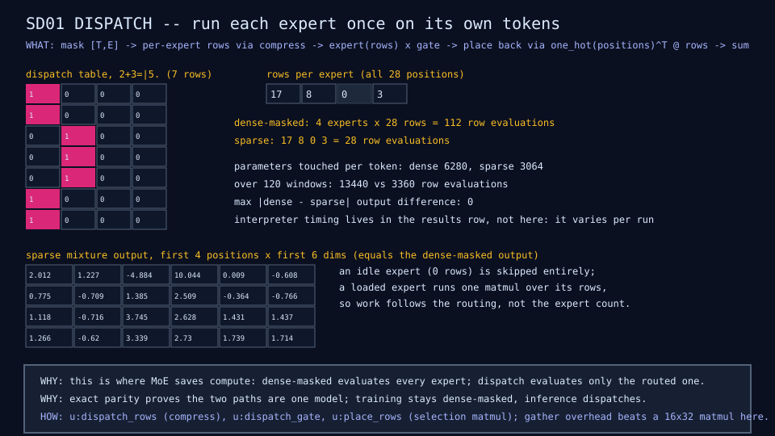

# SD01: sparse dispatch

## Question

Does conditional compute avoid the unused work, exactly?

## Change from the previous experiment

Inference over the MX01 model on the sparse path: gather each expert's
routed rows, run the expert once on that sub-batch, scale by the gate,
scatter back through a one-hot selection matmul. Compared against the
dense-masked path on every window.

## Configuration

MX01 architecture trained 40 epochs (enough to route), then both paths
over all 120 windows of the fixture.

## Results

| Quantity | Dense-masked | Sparse | Source |
|---|---:|---:|---|
| Maximum output difference | 0 | 0 | dispatch diagram |
| Expert row evaluations | 13,440 | 3,360 | dispatch diagram |
| Parameters touched per token | 6,280 | 3,064 | SD01 row |
| Interpreter time per window | 0.42 ms | 0.74 ms | dispatch diagram |



## What we learned

The two paths are the same function; the sparse one does a quarter of the
expert work. In this interpreter it is slower, because gather, scatter,
and loop overhead cost more than three 16-by-32 matmuls
([finding 5](../results/current-findings.md)).

## What we did not prove

That sparse dispatch is faster anywhere. A compiled runtime with fused
kernels and large experts is where the FLOP saving becomes time.

## Raw evidence

```sh
just dispatch        # train 40 epochs, prove parity, count and time both paths
```

Code: `u:dispatch_rows`, `u:place_rows`, `u:dispatch_cost` in
[`lib/moe.mlpl`](../../lib/moe.mlpl);
[`demos/dispatch_microscope.mlpl`](../../demos/dispatch_microscope.mlpl).
