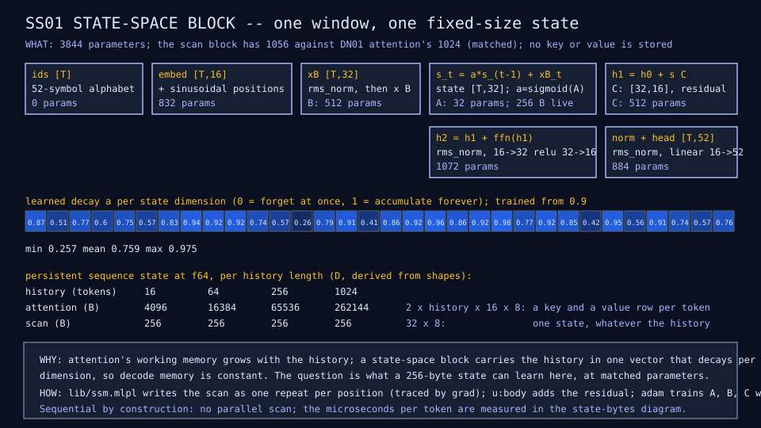
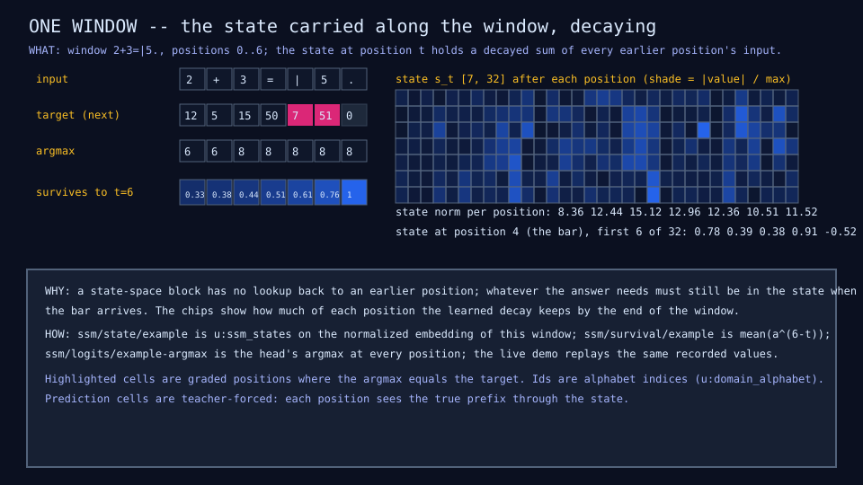
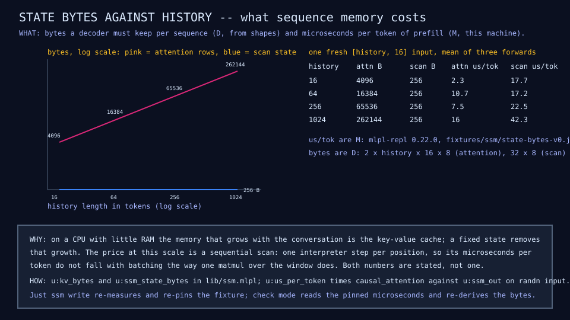

# SS01: simple state-space block

## Question

Can a fixed-size state carry the sequence history instead of attention's
growing key-value cache, and what does that cost and buy at this scale?

## Change from the previous experiment

DN01's attention block is replaced by a diagonal linear state-space scan of
matched size: `s_t = a * s_(t-1) + x_t B`, `y_t = s_t C`, with the decay
`a = sigmoid(A)` learned per state dimension (32 logits), `B` a 16 by 32
projection, and `C` a 32 by 16 projection, followed by the same residual,
feed-forward block, norm, and head. Nothing else changes: the same
embedding, positions, window, split, epochs, learning rate, and masked
loss. The scan block has 1,056 parameters against attention's 1,024.

## Configuration

Embedding width 16, state width 32, hidden width 32; window 28; 120
examples (90 train, 30 validation); 300 epochs; Adam at learning rate
0.003; one process. The scan is written as one `repeat` per position and
traces through `grad` (probe C1); it is sequential by construction, with no
parallel scan. About a minute on a laptop, deterministic, so the diagrams,
the state-bytes fixture, and the results row are checked in the gate.

## Results

| Metric | SS01 | DN01 | Source |
|---|---:|---:|---|
| Parameters | 3,844 | 3,812 | results rows |
| Sequence-mixer parameters | 1,056 | 1,024 | ssm-structure diagram |
| Active parameters per token | 3,028 | 2,996 | results rows |
| Validation masked loss | 4.56 | 3.79 | results rows |
| Perplexity | 95.8 | 44.2 | results rows |
| Held-out exact match: arith / seq / mlpl / prose | 0 / 0 / 0.286 / 0.667 | 0 / 0 / 0 / 0.667 | results rows |
| Training exact match | 0.99 | 0.70 | recordings (`accuracy/train`) |
| Best validation loss along the run | 1.96 at epoch 25 | 1.94 at epoch 25 | recordings |
| Interpreter time per training token | 0.023 ms | 0.020 ms | results rows (machine-dependent) |
| Persistent state at 16 / 1,024 tokens of history | 256 / 256 B | 4,096 / 262,144 B | results rows, last column |
| Learned decay, min / mean / max | 0.26 / 0.76 / 0.98 | - | `ssm/decay` |

Persistent state and prefill cost against history length, from
[`fixtures/ssm/state-bytes-v0.json`](../../fixtures/ssm/state-bytes-v0.json)
(bytes are derived from shapes, D; microseconds are measured on one
machine with `mlpl-repl 0.22.0`, M):

| History (tokens) | Attention K,V bytes | Scan state bytes | Attention us/token | Scan us/token |
|---:|---:|---:|---:|---:|
| 16 | 4,096 | 256 | 2.3 | 17.7 |
| 64 | 16,384 | 256 | 10.7 | 17.2 |
| 256 | 65,536 | 256 | 7.5 | 22.5 |
| 1,024 | 262,144 | 256 | 16.0 | 42.3 |







## What we learned

A 256-byte state learned this domain about as well as attention on the
training rows (exact match 0.99 against 0.70) and worse on the held-out
rows (validation loss 4.56 against 3.79, the same prose answers, one more
held-out MLPL answer). The block memorizes at least as readily: its
validation loss bottoms out at the same first checkpoint as DN01's and then
climbs higher. The learned decay spreads from 0.26 to 0.98 with mean 0.76,
so by the end of a seven-token window about a third of the first position
is still present in the state; the block keeps a soft summary, not an
exact record.

The memory claim holds exactly and by construction: the scan keeps 256
bytes of sequence state at any history while one-head attention keeps 256
bytes per token of history, 262,144 bytes at 1,024 tokens. The speed claim
does not hold in this interpreter: the sequential scan costs 17 to 42
microseconds per token of prefill against 2 to 16 for attention, because
each position is one interpreter step and attention is one matmul over the
window. Both numbers are stated in the diagram and the fixture.

This is [finding 11](../results/current-findings.md).

## What we did not prove

That a state-space block cannot match attention here: one seed, one state
width, 90 training windows, and a decay initialized at 0.9. Whether
input-dependent gating (SS02) or a single attention block among state
blocks (HA01) recovers the held-out loss is the next question. Nothing
here says anything about a compiled scan's speed.

## Raw evidence

```sh
just ssm             # run SS01 and check its diagrams, fixture, and results row
just ssm write       # regenerate the diagrams, re-measure the fixture, and rewrite the SS01 row
just recordings write SS01   # recapture the recording over mlpl-serve
```

Code: [`lib/ssm.mlpl`](../../lib/ssm.mlpl),
[`demos/ssm_block.mlpl`](../../demos/ssm_block.mlpl), tests
[`tests/test_ssm.mlpl`](../../tests/test_ssm.mlpl). Recording:
[`fixtures/recordings/state-space-run-v0.json`](../../fixtures/recordings/state-space-run-v0.json)
(13 frames; the last carries the decay, the state and survival along one
window, the argmax, and the byte accounting). Rows: SS01 and DN01 in the
[results table](../reference/results.md).
