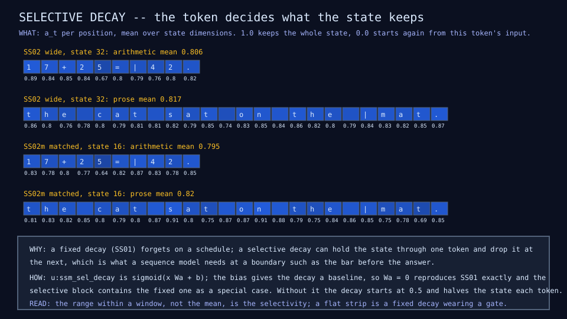
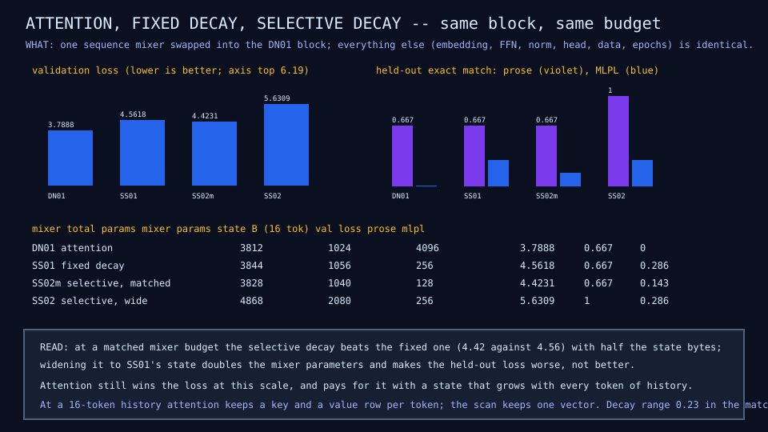

# SS02: selective state-space block

## Question

SS01's fixed decay forgets on a schedule. Does letting the token decide
what the state keeps help where the fixed decay did not, and what does the
block choose to forget on arithmetic against prose?

## Change from the previous experiment

SS01's three constants become functions of the token, a Mamba-like
selective block:

```text
a_t = sigmoid(x_t Wa + b)   decay per state dimension, in (0, 1)
b_t = x_t Wb                what this token writes into the state
c_t = x_t Wc                what this token reads out of it
s_t = a_t * s_(t-1) + b_t
y_t = (s_t * c_t) Wo
```

The bias `b` matters more than it looks. With it, `Wa = 0` reproduces
SS01's fixed decay exactly, so the selective block strictly contains the
constant one and a worse result cannot be blamed on the block being unable
to express the simpler model. Without it the decay starts at one half and
the state loses half its content every position; that version was measured
first and reached validation loss 5.86, against 5.63 with the bias.

Two variants, one process each (finding F22):

- **SS02 wide**, state width 32, so the persistent state is 256 bytes as
  in SS01. The mixer costs 2,080 parameters, twice SS01's.
- **SS02m matched**, state width 16, so the mixer costs 1,040 parameters
  against SS01's 1,056 and attention's 1,024. This is the comparison that
  is not confounded by capacity.

## Configuration

Embedding width 16, hidden width 32; window 28; 120 examples (90 train, 30
validation); 300 epochs; Adam at learning rate 0.003. The scan is one
`repeat` per position, sequential by construction. About 25 seconds for
the wide variant and 20 for the matched one.

## Results

| Mixer | Total params | Mixer params | State bytes at 16 tokens | Validation loss | Held-out prose | Held-out MLPL |
|---|---:|---:|---:|---:|---:|---:|
| DN01 attention | 3,812 | 1,024 | 4,096 | 3.79 | 0.667 | 0 |
| SS01 fixed decay | 3,844 | 1,056 | 256 | 4.56 | 0.667 | 0.286 |
| SS02m selective, matched | 3,828 | 1,040 | 128 | 4.42 | 0.667 | 0.143 |
| SS02 selective, wide | 4,868 | 2,080 | 256 | 5.63 | 1.0 | 0.286 |

Learned decay, mean over state dimensions:

| Window | SS02 wide | SS02m matched |
|---|---|---|
| `17+25=\|42.` | 0.81, range 0.67 to 0.89 | 0.80, range 0.64 to 0.87 |
| `the cat sat on the \|mat.` | 0.82, range 0.74 to 0.87 | 0.82, range 0.69 to 0.91 |

Training exact match is 1.0 on every family for the wide variant and 0.87
overall for the matched one.





## What we learned

At a matched mixer budget, selection is worth a little: validation loss
4.42 against the fixed decay's 4.56, with half the state bytes (128
against 256). That is the honest headline, and it is a small win.

Widening the selective block to SS01's state width makes it worse, not
better: 5.63, the highest loss of the four mixers, with the training rows
memorized completely. The extra 1,040 mixer parameters bought capacity to
memorize 90 windows, which is [finding 1](../results/current-findings.md)
appearing again in a new place. Its one bright spot is held-out prose at
1.0, the only mixer to answer every prose prompt, which fits prose being
the family a local pattern can carry.

The decay strips show why the win is small. The learned decay sits near
0.8 with a range of about 0.2 within a window: the block does modulate
per token, but it has not learned a sharp gate that holds the state
through the prompt and resets at the bar. Comparing the two families, the
arithmetic strip dips lowest at the equals sign in both variants, which is
the one place the block appears to mark a boundary. Selectivity is real
here and narrow.

Attention still wins the loss at this scale and pays for it with a state
that grows with every token of history.

## What we did not prove

That a sharper gate is unreachable: one seed, one initialization of the
decay bias at the value SS01 converged near, no schedule on the learning
rate, and 90 training windows. Nothing here separates "selection does not
help this domain" from "300 epochs on 90 windows cannot train a gate".
The strips are one window each, not a statistic over the corpus.

## Raw evidence

```sh
just ssm2            # run both variants and check the diagrams and results rows
just ssm2 write      # regenerate the diagrams and the SS02 and SS02m rows
just tests tests/test_ssm.mlpl
```

Code: [`lib/ssm.mlpl`](../../lib/ssm.mlpl) (`u:ssm_sel_decay`,
`u:ssm_sel_scan`, `u:ssm_sel_out`),
[`demos/ssm_selective.mlpl`](../../demos/ssm_selective.mlpl),
[`demos/ssm_selective_diagram.mlpl`](../../demos/ssm_selective_diagram.mlpl),
tests [`tests/test_ssm.mlpl`](../../tests/test_ssm.mlpl) (the gates depend
on the token, the selective scan reduces to the fixed one under a constant
gate, gradients reach every part). Recording:
[`fixtures/recordings/selective-state-space-run-v0.json`](../../fixtures/recordings/selective-state-space-run-v0.json).
Rows SS02 and SS02m in the [results table](../reference/results.md).
