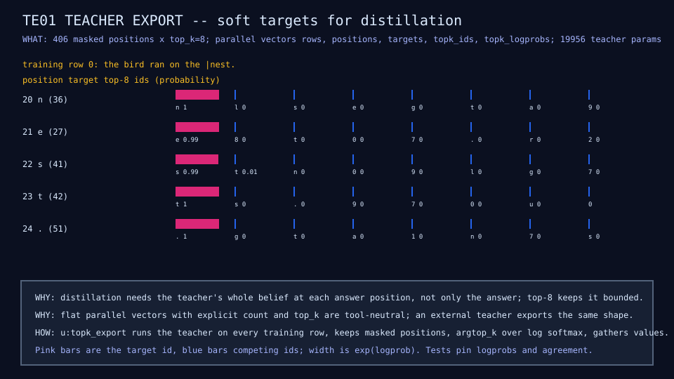

# TE01: in-repo teacher fixture

## Question

Is there a usable source of soft targets for distillation without
depending on an external model?

## Change from the previous experiment

A larger dense model (width 32, hidden 64, two blocks) trained once on the
same 90 rows, exporting top-8 next-token log-probabilities at every answer
position.

## Configuration

19,956 parameters; 300 epochs at learning rate 0.001; about a minute;
export as flat parallel vectors (finding: nested arrays do not round-trip
through the JSON builtins). Schema in
[teacher fixture](../implementation/teacher-fixture.md).

## Results

| Metric | Value | Source |
|---|---:|---|
| Parameters | 19,956 | TE01 row |
| Top-1 agreement with targets, training split | 0.963 | teacher-fixture diagram |
| Training exact match | 0.83 | teacher-fixture diagram |
| Validation loss | 4.14 | TE01 row |
| Held-out exact match, all families | 0 | TE01 row |
| Exported answer positions | 406 | fixture index |



## What we learned

The teacher fits the training rows far better than the students, so its
distributions carry more information than one-hot labels. It does not
generalize ([finding 7](../results/current-findings.md)).

## What we did not prove

That distillation from it helps; KD01 tests that. If a stronger teacher
is needed, an external model can export the same schema.

## Raw evidence

```sh
just teacher         # validate the committed fixture, index, preview, and results row
just teacher write   # retrain the teacher (about a minute) and reinstall everything
```

Fixture: [`fixtures/teacher/teacher-v0.json`](../../fixtures/teacher/teacher-v0.json),
[`fixtures/teacher/index-v1.json`](../../fixtures/teacher/index-v1.json).
Code: [`demos/teacher.mlpl`](../../demos/teacher.mlpl).
